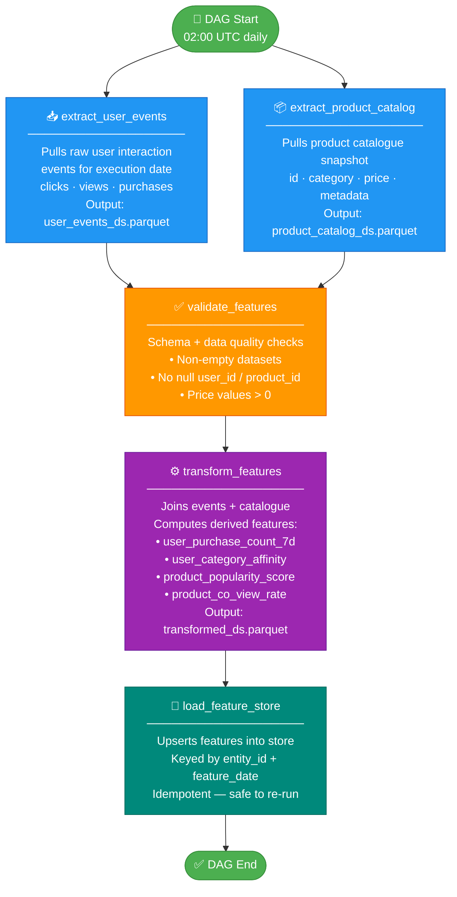
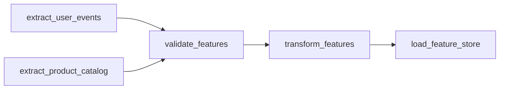
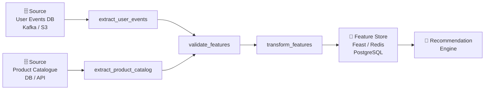
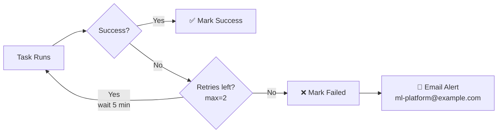

# Product Recs – Feature Ingestion Pipeline

## Overview

| Attribute           | Value                                                                              |
|---------------------|------------------------------------------------------------------------------------|
| **DAG ID**          | `product_recommendation_feature_ingestion`                                         |
| **File**            | `dags/product_recs_feature.py`                                                     |
| **Owner**           | ml-platform                                                                        |
| **Schedule**        | `0 2 * * *` — daily at 02:00 UTC                                                   |
| **Catchup**         | `False`                                                                            |
| **Max Active Runs** | 1                                                                                  |
| **Retries**         | 2 (retry delay: 5 minutes)                                                         |
| **Tags**            | `ml`, `feature-ingestion`, `product-recommendation`                                |
| **Operator Type**   | `@task` decorator (`PythonOperator`)                                               |
| **Purpose**         | Ingest user events & product catalogue → validate → transform → load feature store |

---

## DAG Flow

---

## Task Details

| Task | Runs after | What it does | Output |
|---|---|---|---|
| `extract_user_events` | DAG start | Fetches raw click/view/purchase events for `ds` | `user_events_{ds}.parquet` |
| `extract_product_catalog` | DAG start | Fetches product catalogue snapshot for `ds` | `product_catalog_{ds}.parquet` |
| `validate_features` | Both extract tasks | Schema + nullability + range checks | Validated metadata dict |
| `transform_features` | validate | Joins datasets, computes 4 derived features | `transformed_{ds}.parquet` |
| `load_feature_store` | transform | Upserts into feature store by `entity_id + feature_date` | — |

---

## Dependency Graph

---

## Data Flow

---

## Retry & Alerting Policy

