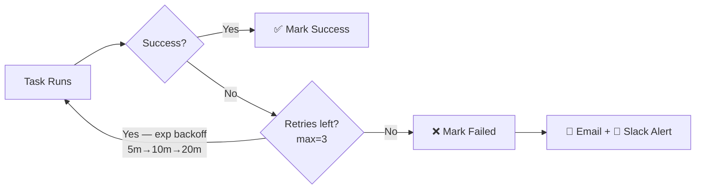
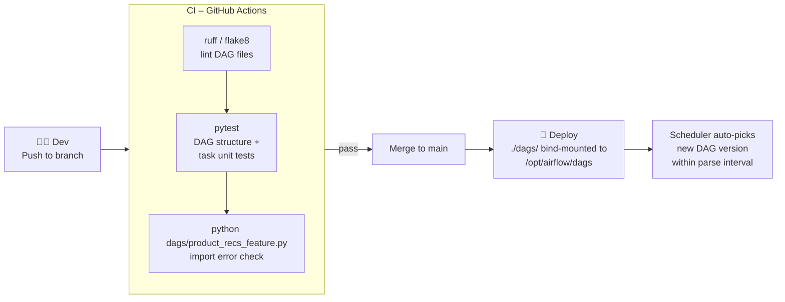

# Airflow Best Practices – ML Feature Ingestion Pipeline

> Applies to: `product_recommendation_feature_ingestion` DAG  
> File: `dags/product_recs_feature.py`  
> Stack: Apache Airflow 2.8.1 · LocalExecutor · PostgreSQL 15 · Docker Compose  
> Last updated: 2026-03-29

---

## Table of Contents

1. [DAG Design](#1-dag-design)
2. [Task Design](#2-task-design)
3. [Idempotency & Backfilling](#3-idempotency--backfilling)
4. [Scheduling](#4-scheduling)
5. [Retries & Alerting](#5-retries--alerting)
6. [Secrets & Configuration](#6-secrets--configuration)
7. [Logging & Observability](#7-logging--observability)
8. [Testing](#8-testing)
9. [CI/CD & Deployment](#9-cicd--deployment)
10. [Current DAG vs Best Practice Gap Analysis](#10-current-dag-vs-best-practice-gap-analysis)

---

## 1. DAG Design

### ✅ Use the `@dag` decorator (already applied)
The current DAG uses the modern Airflow 2 `@dag` + `@task` TaskFlow API instead of the legacy
`DAG()` context manager. This keeps task logic, dependencies, and XCom passing in pure Python
with no boilerplate.

```python
# ✅ Current approach – clean and Pythonic
from airflow.decorators import dag, task

@dag(
    dag_id='product_recommendation_feature_ingestion',
    default_args=default_args,
    schedule_interval='0 2 * * *',
    catchup=False,
    max_active_runs=1,
    tags=['ml', 'feature-ingestion', 'product-recommendation'],
)
def product_recommendation_feature_ingestion():
    ...
```

### ✅ `default_args` centralises shared task config (already applied)
`retries`, `retry_delay`, `email_on_failure`, and `owner` are all in `default_args` — no need
to repeat them on each `@task`.

```python
# ✅ Current default_args
default_args = {
    'owner': 'ml-platform',
    'depends_on_past': False,
    'start_date': days_ago(1),
    'email': ['ml-platform@example.com'],
    'email_on_failure': True,
    'retries': 2,
    'retry_delay': timedelta(minutes=5),
}
```

### ✅ `catchup=False` and `max_active_runs=1` (already applied)
Prevents a flood of backfill runs on first deploy and stops two daily runs writing to the
feature store simultaneously.

### ✅ DAG tags for discoverability (already applied)
```python
tags=['ml', 'feature-ingestion', 'product-recommendation']
```

### ✅ Keep DAGs in a flat `dags/` folder
One file per DAG. Deep nesting slows the scheduler's parse cycle.

```
dags/
  product_recs_feature.py     ← feature ingestion  ← current
  product_recs_training.py    ← model training      (future)
  product_recs_serving.py     ← score generation    (future)
```

### ❌ Avoid top-level code that hits the DB or network
The scheduler imports every DAG file repeatedly. Any I/O at module level slows the whole cluster.

```python
# ❌ Bad – runs on every scheduler parse cycle
conn = psycopg2.connect(...)
rows = conn.execute("SELECT * FROM events")

# ✅ Good – only runs when the task executes
@task
def extract_user_events(ds: str) -> dict:
    conn = psycopg2.connect(...)   # safe inside a task
    ...
```

---

## 2. Task Design

### ✅ Use `@task` decorator for all feature logic (already applied)
The current DAG defines all five tasks as `@task` Python functions. This is the recommended
pattern for ML pipelines — fully testable, type-safe, and no operator boilerplate.

```
extract_user_events    → pulls raw click/view/purchase events
extract_product_catalog→ pulls product catalogue snapshot
validate_features      → schema + data quality checks
transform_features     → join + compute derived features
load_feature_store     → upsert into feature store
```

### ✅ Keep tasks atomic — one responsibility per task (already applied)
Each task in the pipeline has a single, clear job. Never mix extraction + transformation
in the same task; a failure mid-way makes it hard to retry cleanly.

### ✅ Run independent tasks in parallel (already applied)
`extract_user_events` and `extract_product_catalog` have no dependency on each other and
run in parallel, reducing total wall-clock time.

```python
# ✅ Current wiring — parallel extracts fan into validate
user_events     = extract_user_events()
product_catalog = extract_product_catalog()
validated       = validate_features(user_events, product_catalog)  # waits for both
transformed     = transform_features(validated)
load_feature_store(transformed)
```

### ✅ Pass small metadata via XCom — never DataFrames (already applied)
Each `@task` returns a lightweight `dict` with `path`, `rows`, and `date`.
The actual data stays on disk (`/tmp/features/*.parquet`). XCom only carries the pointer.

```python
# ✅ Current pattern — small dict, safe for the Postgres metadata DB
return {"path": output_path, "rows": row_count, "date": ds}
```

```python
# ❌ Never do this — will bloat and eventually break the metadata DB
return df          # a pandas DataFrame does not belong in XCom
```

### ❌ Avoid `depends_on_past=True` unless you need strict sequential consistency
Currently `False` in `default_args` — keep it that way for a daily feature pipeline where
each run is independent.

---

## 3. Idempotency & Backfilling

### ✅ Make `load_feature_store` idempotent
Re-running the same DAG for the same `ds` must not duplicate features in the store.
Use upsert semantics keyed on `(entity_id, feature_date)`.

```python
# ✅ Recommended implementation for load_feature_store
@task
def load_feature_store(transformed: dict) -> None:
    ds = transformed["date"]
    engine.execute("""
        INSERT INTO feature_store (entity_id, feature_date, value)
        VALUES (%s, %s, %s)
        ON CONFLICT (entity_id, feature_date)
        DO UPDATE SET value = EXCLUDED.value, updated_at = NOW()
    """, ...)
```

### ✅ Use `ds` for date-partitioned paths (already applied)
Every file written by the pipeline is partitioned by execution date, making reruns safe
and backfills predictable.

```python
# ✅ Current pattern — already in all extract / transform tasks
output_path = f"/tmp/features/user_events_{ds}.parquet"
output_path = f"/tmp/features/transformed_{ds}.parquet"
```

### ✅ Test backfilling with `--dry-run` before enabling `catchup`

```bash
# Simulate a backfill without executing any tasks
airflow dags backfill \
  -s 2026-03-01 -e 2026-03-28 \
  --dry-run \
  product_recommendation_feature_ingestion
```

---

## 4. Scheduling

### ✅ Cron string over `timedelta` (already applied)
```python
schedule_interval='0 2 * * *'   # 2 AM UTC — explicit, visible in the UI
```

| Pipeline stage | Recommended cron | Reason |
|---|---|---|
| Feature ingestion (current) | `0 2 * * *` | After midnight ETL completes |
| Hourly event micro-batch | `0 * * * *` | Near-realtime features |
| Weekly model retraining | `0 3 * * 1` | Monday 3 AM after weekly data settle |
| Monthly catalogue refresh | `0 4 1 * *` | First of month |

### ✅ `max_active_runs=1` (already applied)
Prevents concurrent daily runs from racing to write the same `feature_date` partition.

---

## 5. Retries & Alerting

### Current config (in `default_args`)
```python
'retries': 2,
'retry_delay': timedelta(minutes=5),   # fixed delay
'email_on_failure': True,
'email': ['ml-platform@example.com'],
```

### ✅ Upgrade to exponential backoff for production

Transient source-system errors (network blips, DB locks) often resolve within minutes.
Exponential backoff avoids hammering a struggling upstream service.

```python
# ✅ Recommended upgrade
default_args = {
    ...
    'retries': 3,
    'retry_delay': timedelta(minutes=5),
    'retry_exponential_backoff': True,    # 5m → 10m → 20m
    'max_retry_delay': timedelta(minutes=60),
}
```

### ✅ Add a Slack callback for on-call awareness

```python
def slack_alert(context):
    from airflow.providers.slack.operators.slack_webhook import SlackWebhookOperator
    SlackWebhookOperator(
        task_id='slack_alert',
        slack_webhook_conn_id='slack_ml_alerts',
        message=(
            f":red_circle: *{context['dag'].dag_id}* | "
            f"task `{context['task'].task_id}` failed on `{context['ds']}`\n"
            f"<{context['task_instance'].log_url}|View logs>"
        ),
    ).execute(context)

default_args = {
    ...
    'on_failure_callback': slack_alert,
}
```

### Retry flow



---

## 6. Secrets & Configuration

### ❌ Credentials hardcoded in `docker-compose.yml` — fix before going to production

```yaml
# ❌ Current state — must not be committed to git as-is
POSTGRES_PASSWORD: airflow
AIRFLOW__CORE__FERNET_KEY: jsDPRErfv8Z_eVTnGfF8ywd19j4pyqE3NpdUBA_oRTo=
AIRFLOW__WEBSERVER__SECRET_KEY: supersecretkey
```

### ✅ Move secrets to a `.env` file (add to `.gitignore`)

```bash
# .env  ← never commit this file
POSTGRES_PASSWORD=<strong-random-password>
AIRFLOW__CORE__FERNET_KEY=$(python -c "from cryptography.fernet import Fernet; print(Fernet.generate_key().decode())")
AIRFLOW__WEBSERVER__SECRET_KEY=$(openssl rand -hex 32)
```

```yaml
# docker-compose.yml — reference env vars, no hardcoded values
environment:
  - POSTGRES_PASSWORD=${POSTGRES_PASSWORD}
  - AIRFLOW__CORE__FERNET_KEY=${AIRFLOW__CORE__FERNET_KEY}
  - AIRFLOW__WEBSERVER__SECRET_KEY=${AIRFLOW__WEBSERVER__SECRET_KEY}
```

### ✅ Store source system credentials as Airflow Connections

```bash
# Register feature store DB connection via CLI
airflow connections add 'feature_store_db' \
  --conn-type postgres \
  --conn-host <host> \
  --conn-login airflow \
  --conn-password ${FEATURE_STORE_PASSWORD} \
  --conn-port 5432 \
  --conn-schema features
```

```python
# ✅ Reference in load_feature_store — zero credentials in code
from airflow.providers.postgres.hooks.postgres import PostgresHook

@task
def load_feature_store(transformed: dict) -> None:
    hook = PostgresHook(postgres_conn_id='feature_store_db')
    hook.run("""
        INSERT INTO feature_store ...
        ON CONFLICT ... DO UPDATE ...
    """)
```

### ✅ Use Airflow Variables for runtime pipeline parameters

```python
from airflow.models import Variable

# Configurable without redeploying the DAG
FEATURE_WINDOW_DAYS = int(Variable.get('feature_window_days', default_var=7))
MIN_EVENT_ROWS      = int(Variable.get('min_event_rows',      default_var=100))
```

---

## 7. Logging & Observability

### ✅ Task docstrings render in the Airflow UI (already applied)
Every `@task` in the current DAG has a `#### Task Name` docstring. These appear in the
**Task Instance Details** panel in the UI — keep them accurate as the pipeline evolves.

```python
# ✅ Current pattern — maintain for all tasks
@task(task_id='validate_features')
def validate_features(user_events: dict, product_catalog: dict) -> dict:
    """
    #### Validate Features
    Runs schema and data quality checks on both extracted datasets.
    Checks:
    - Non-empty datasets
    - No null user_id / product_id
    - Price values > 0
    """
```

### ✅ Emit custom metrics via StatsD

```python
@task
def transform_features(validated: dict) -> dict:
    from airflow.stats import Stats
    import time
    t0 = time.time()
    # ... transformation logic ...
    Stats.gauge('feature_ingestion.transformed_rows', row_count)
    Stats.timing('feature_ingestion.transform_ms', int((time.time() - t0) * 1000))
    return {"path": output_path, "date": ds}
```

### ✅ SLA miss alerts for late feature delivery

```python
def sla_miss_alert(dag, task_list, blocking_task_list, slas, blocking_tis):
    # notify on-call that features will be late for the recommendation engine
    ...

@dag(
    ...
    sla_miss_callback=sla_miss_alert,
    default_args={
        ...
        'sla': timedelta(hours=2),   # features must land by 04:00 UTC
    }
)
```

---

## 8. Testing

### ✅ Unit test DAG structure against the actual task IDs

```python
# tests/test_product_recs_dag.py
from airflow.models import DagBag

def test_dag_loads_without_errors():
    dagbag = DagBag(dag_folder='dags/', include_examples=False)
    assert 'product_recommendation_feature_ingestion' in dagbag.dags
    assert dagbag.import_errors == {}

def test_task_count():
    dag = DagBag(dag_folder='dags/', include_examples=False) \
            .get_dag('product_recommendation_feature_ingestion')
    assert len(dag.tasks) == 5

def test_parallel_extract_tasks():
    dag = DagBag(dag_folder='dags/', include_examples=False) \
            .get_dag('product_recommendation_feature_ingestion')
    # both extract tasks must be independent (no dependency between them)
    extract_events  = dag.get_task('extract_user_events')
    extract_catalog = dag.get_task('extract_product_catalog')
    assert extract_catalog.task_id not in [t.task_id for t in extract_events.downstream_list]
    assert extract_events.task_id  not in [t.task_id for t in extract_catalog.downstream_list]

def test_pipeline_order():
    dag = DagBag(dag_folder='dags/', include_examples=False) \
            .get_dag('product_recommendation_feature_ingestion')
    validate  = dag.get_task('validate_features')
    transform = dag.get_task('transform_features')
    load      = dag.get_task('load_feature_store')
    assert 'validate_features'  in [t.task_id for t in transform.upstream_list]
    assert 'transform_features' in [t.task_id for t in load.upstream_list]
    # both extract tasks feed into validate
    assert {t.task_id for t in validate.upstream_list} == {
        'extract_user_events', 'extract_product_catalog'
    }
```

### ✅ Unit test individual task functions in isolation

```python
def test_validate_features_passes():
    user_events     = {"path": "/tmp/ue.parquet",  "rows": 500,  "date": "2026-03-28"}
    product_catalog = {"path": "/tmp/pc.parquet",  "rows": 1200, "date": "2026-03-28"}
    result = validate_features.function(user_events, product_catalog)
    assert "user_events"     in result
    assert "product_catalog" in result

def test_validate_features_fails_on_empty():
    with pytest.raises(ValueError, match="empty"):
        validate_features.function(
            {"path": "/tmp/ue.parquet", "rows": 0, "date": "2026-03-28"},
            {"path": "/tmp/pc.parquet", "rows": 100, "date": "2026-03-28"},
        )

def test_transform_features_output_path():
    validated = {
        "user_events":     {"path": "/tmp/ue.parquet", "rows": 500,  "date": "2026-03-28"},
        "product_catalog": {"path": "/tmp/pc.parquet", "rows": 1200, "date": "2026-03-28"},
    }
    result = transform_features.function(validated)
    assert result["path"] == "/tmp/features/transformed_2026-03-28.parquet"
    assert result["date"] == "2026-03-28"
```

### ✅ Test-run individual tasks locally via the CLI

```bash
# Parse DAG for import / syntax errors
python dags/product_recs_feature.py

# Test-run each task without persisting state to the metadata DB
airflow tasks test product_recommendation_feature_ingestion extract_user_events    2026-03-28
airflow tasks test product_recommendation_feature_ingestion extract_product_catalog 2026-03-28
airflow tasks test product_recommendation_feature_ingestion validate_features       2026-03-28
airflow tasks test product_recommendation_feature_ingestion transform_features      2026-03-28
airflow tasks test product_recommendation_feature_ingestion load_feature_store      2026-03-28
```

---

## 9. CI/CD & Deployment

### ✅ Recommended CI pipeline for DAG changes



### ✅ Pin all image versions (already applied)
```yaml
# docker-compose.yml — already correct
image: apache/airflow:2.8.1
image: postgres:15
```

### ✅ Manage Python dependencies in `requirements.txt`

```
apache-airflow==2.8.1
apache-airflow-providers-postgres==5.10.0
pandas==2.2.0
pyarrow==15.0.0
great-expectations==0.18.0   # for validate_features
pandera==0.18.0              # alternative lightweight validator
```

### ✅ Add a `.gitignore`

```gitignore
.env
__pycache__/
*.pyc
*.pyo
.airflow/
logs/
```

---

## 10. Current DAG vs Best Practice Gap Analysis

| Area | Current State | Status | Recommended Action |
|---|---|---|---|
| **Operator type** | `@task` (PythonOperator) | ✅ Done | — |
| **DAG decorator** | `@dag` TaskFlow API | ✅ Done | — |
| **catchup** | `False` | ✅ Done | — |
| **max_active_runs** | `1` | ✅ Done | — |
| **Scheduling** | `'0 2 * * *'` cron | ✅ Done | — |
| **Parallel extracts** | `extract_user_events` \|\| `extract_product_catalog` | ✅ Done | — |
| **XCom safety** | Passes `dict` with path, not DataFrame | ✅ Done | — |
| **Idempotency** | Date-partitioned output paths | ✅ Done | Add upsert to `load_feature_store` |
| **Alerting** | `email_on_failure=True` | ✅ Done | Add Slack `on_failure_callback` |
| **Retries** | 2 retries, fixed 5-min delay | ⚠️ Partial | Upgrade to exponential backoff, increase to 3 |
| **Task docstrings** | All 5 tasks documented | ✅ Done | Keep up to date as logic evolves |
| **Tags** | `ml`, `feature-ingestion`, `product-recommendation` | ✅ Done | — |
| **Secrets** | Hardcoded in `docker-compose.yml` | ❌ Todo | Move to `.env` + Airflow Connections |
| **Validation logic** | Placeholder `print` statements | ⚠️ Todo | Implement Great Expectations / Pandera |
| **Transform logic** | Placeholder `print` statements | ⚠️ Todo | Implement pandas / Spark joins |
| **Load logic** | Placeholder `print` statements | ⚠️ Todo | Implement upsert with `PostgresHook` |
| **Custom metrics** | None | ⚠️ Todo | Add `Stats.gauge` for row counts & duration |
| **SLA callback** | None | ⚠️ Todo | Add `sla_miss_callback` + `sla: 2h` |
| **Unit tests** | None | ❌ Todo | Add `DagBag` + task function tests |
| **`.gitignore`** | Not present | ❌ Todo | Add `.env`, `__pycache__/`, `*.pyc` |
| **`requirements.txt`** | Not present | ❌ Todo | Add and bake into Docker image |


