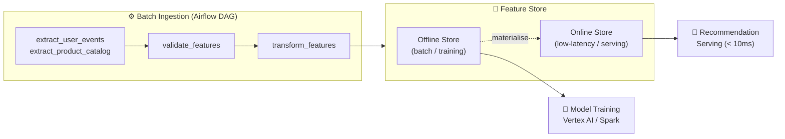
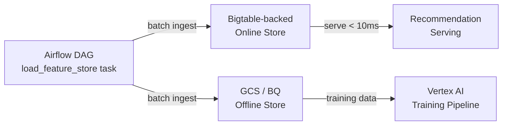
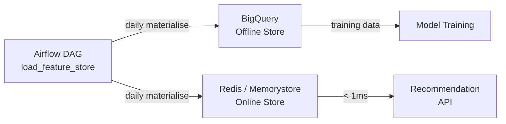
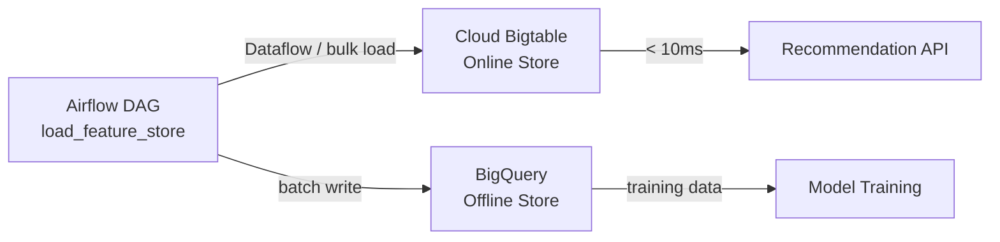
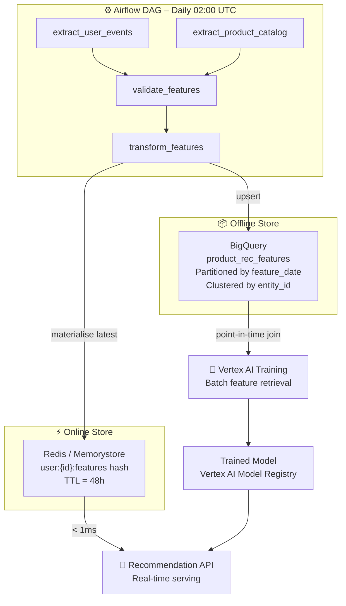
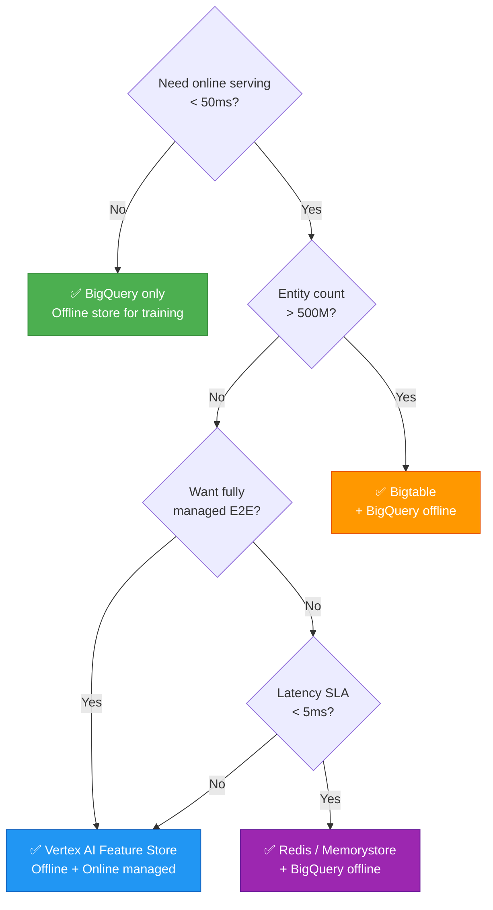
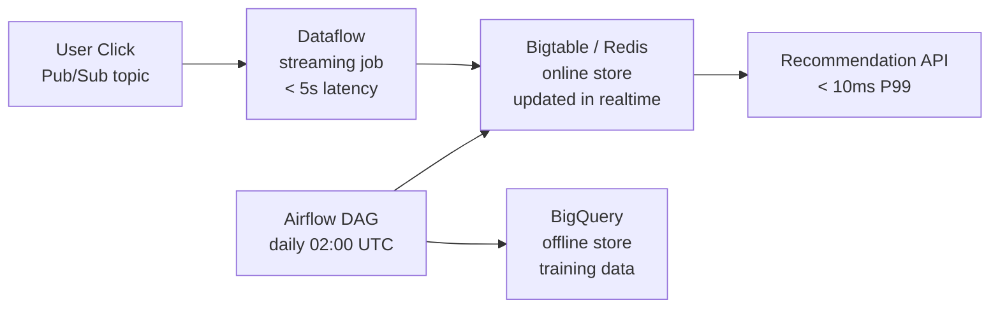

# Feature Store Best Practices – Product Recommendation Pipeline

> Designed for **high-throughput, low-latency** systems at Google / Amazon scale  
> 10B+ events/day · 500M+ entities · < 10 ms online serving SLA  
> Stores evaluated: BigQuery · Vertex AI Feature Store · Redis · Bigtable  
> Last updated: 2026-03-29

---

## Table of Contents

1. [Feature Store Landscape](#1-feature-store-landscape)
2. [BigQuery as Feature Store](#2-bigquery-as-feature-store)
3. [Vertex AI Feature Store](#3-vertex-ai-feature-store)
4. [Redis as Feature Store](#4-redis-as-feature-store)
5. [Bigtable as Feature Store](#5-bigtable-as-feature-store)
6. [Side-by-Side Comparison](#6-side-by-side-comparison)
7. [Recommended Architecture for Product Recommendation](#7-recommended-architecture-for-product-recommendation)
8. [Airflow Integration Patterns](#8-airflow-integration-patterns)
9. [Decision Guide](#9-decision-guide)

---

## 1. Feature Store Landscape

A feature store sits between the feature ingestion pipeline and the recommendation model,
serving two distinct workloads:



| Layer | Purpose | Latency requirement |
|---|---|---|
| **Offline store** | Point-in-time correct feature retrieval for training | seconds–minutes |
| **Online store** | Real-time feature lookup at serving time | < 10 ms |

The current `load_feature_store` task writes to the **offline store** on a daily schedule.
Materialisation to the online store is a separate step.

---

## 2. BigQuery as Feature Store

### Overview
Use BigQuery as the **offline store** for batch feature retrieval and model training.
It is the natural choice when your raw data already lives in BigQuery (user events, product catalogue).

### ✅ Best Practices

#### Schema — partition by `feature_date`, cluster by `entity_id`

```sql
CREATE TABLE IF NOT EXISTS `my_project.feature_store.product_rec_features`
(
    entity_id       STRING    NOT NULL,   -- user_id or product_id
    feature_date    DATE      NOT NULL,
    -- user features
    purchase_count_7d   INT64,
    category_affinity   FLOAT64,
    -- product features
    popularity_score    FLOAT64,
    co_view_rate        FLOAT64,
    -- metadata
    created_at      TIMESTAMP NOT NULL
)
PARTITION BY feature_date          -- prunes scanned bytes per query
CLUSTER BY entity_id               -- speeds up point lookups by entity
OPTIONS (
    partition_expiration_days = 365,
    require_partition_filter  = TRUE  -- forces callers to always filter by date
);
```

#### Writes — always upsert (idempotent DAG reruns)

```python
# ✅ In load_feature_store — safe to re-run for same ds
from airflow.providers.google.cloud.hooks.bigquery import BigQueryHook

@task
def load_feature_store(transformed: dict) -> None:
    hook = BigQueryHook(gcp_conn_id='google_cloud_default')
    hook.run("""
        MERGE `my_project.feature_store.product_rec_features` T
        USING (SELECT * FROM `my_project.feature_store.staging_{{ ds }}`) S
        ON T.entity_id = S.entity_id AND T.feature_date = S.feature_date
        WHEN MATCHED     THEN UPDATE SET T.purchase_count_7d = S.purchase_count_7d, ...
        WHEN NOT MATCHED THEN INSERT ROW
    """)
```

#### Point-in-time correct training data retrieval

```sql
-- Retrieve the feature snapshot that was available at training_cutoff_date
-- Prevents future leakage into training features
SELECT
    e.entity_id,
    e.label,
    f.purchase_count_7d,
    f.category_affinity,
    f.popularity_score
FROM `my_project.labels.training_examples` e
LEFT JOIN `my_project.feature_store.product_rec_features` f
    ON  f.entity_id   = e.entity_id
    AND f.feature_date = (
        SELECT MAX(feature_date)
        FROM `my_project.feature_store.product_rec_features`
        WHERE entity_id   = e.entity_id
          AND feature_date <= e.training_cutoff_date   -- ← point-in-time correct
    )
```

#### Cost — always filter on `feature_date`

```python
# ✅ Always pass the execution date to avoid full table scans
query = f"""
    SELECT * FROM `my_project.feature_store.product_rec_features`
    WHERE feature_date = '{ds}'
"""
```

### Pros and Cons

| | Details |
|---|---|
| ✅ **No extra infra** | Already in the GCP stack — no new service to manage |
| ✅ **Unlimited scale** | Petabyte-scale, serverless, auto-scales |
| ✅ **SQL-native** | Familiar to data scientists and engineers |
| ✅ **Point-in-time correct** | Easy to implement with `feature_date` partition |
| ✅ **Versioning built-in** | Keep all historical partitions for reproducibility |
| ✅ **BQ ML integration** | `BQML` can train directly on feature tables |
| ❌ **Not for online serving** | P99 latency ~1–5s — too slow for real-time recommendations |
| ❌ **Cost at high query volume** | Per-byte pricing punishes frequent ad-hoc queries |
| ❌ **No TTL / expiry per row** | Must manage staleness via partition expiration |
| ❌ **Cold start latency** | First query against a new partition can be slow |

---

## 3. Vertex AI Feature Store

### Overview
Google's **managed feature store** with a built-in offline + online store, point-in-time
retrieval, monitoring, and Feast-compatible API. Best when you want a fully managed solution
with automatic online materialisation.

### Architecture



### ✅ Best Practices

#### Define a Feature Group and Feature View

```python
from google.cloud import aiplatform
from google.cloud.aiplatform import Feature, FeatureGroup, FeatureOnlineStore

# One-time setup — define the feature group pointing to a BQ source
feature_group = FeatureGroup.create(
    name='product_rec_features',
    source=aiplatform.utils.FeatureGroupBigQuerySource(
        uri='bq://my_project.feature_store.product_rec_features',
        entity_id_columns=['entity_id'],
    ),
    project='my_project',
    location='us-central1',
)

# Create individual features
feature_group.batch_create_features(feature_ids=[
    'purchase_count_7d',
    'category_affinity',
    'popularity_score',
    'co_view_rate',
])
```

#### Ingest from the Airflow `load_feature_store` task

```python
from airflow.providers.google.cloud.operators.vertex_ai.feature_store import (
    VertexAIFeatureStoreIngestOperator,
)

@dag(...)
def product_recommendation_feature_ingestion():
    ...
    load_feature_store = VertexAIFeatureStoreIngestOperator(
        task_id='load_feature_store',
        project='my_project',
        location='us-central1',
        featurestore_id='product_rec_featurestore',
        entity_type_id='user',
        feature_ids=['purchase_count_7d', 'category_affinity'],
        feature_time='feature_date',
        gcs_source_uris=['gs://ml-feature-ingestion-bucket/transformed/{{ ds }}.parquet'],
        gcs_source_type='parquet',
        gcp_conn_id='google_cloud_default',
    )
```

#### Online serving — fetch at inference time

```python
from google.cloud.aiplatform_v1beta1 import FeatureOnlineStoreServiceClient

client = FeatureOnlineStoreServiceClient()
response = client.fetch_feature_values(
    feature_view='projects/my_project/locations/us-central1/'
                 'featureOnlineStores/prod_store/featureViews/product_rec_features',
    data_key={'key': user_id},
)
```

#### Monitor feature drift via Vertex AI monitoring

```python
# Enable monitoring when creating the feature view
feature_view = online_store.create_feature_view(
    name='product_rec_features',
    ...
    sync_config=FeatureViewSyncConfig(cron='0 3 * * *'),  # sync daily after DAG
    feature_registry_source=FeatureRegistrySource(
        feature_groups=[FeatureRegistrySource.FeatureGroup(
            feature_group_id='product_rec_features',
        )]
    ),
)
```

### Pros and Cons

| | Details |
|---|---|
| ✅ **Fully managed** | No infrastructure to provision, patch, or scale |
| ✅ **Offline + online in one** | Single API for training retrieval and low-latency serving |
| ✅ **Point-in-time correct** | Built-in `feature_timestamp` support |
| ✅ **Feature monitoring** | Drift detection, staleness alerts out of the box |
| ✅ **Feast compatible** | Standard open-source SDK works with Vertex AI backend |
| ✅ **BQ native source** | Reads directly from BQ offline store |
| ❌ **GCP lock-in** | Tightly coupled to Google Cloud — hard to migrate |
| ❌ **Cost** | Storage + serving node + ingestion costs add up quickly |
| ❌ **Serving node always on** | Online store nodes billed 24/7 even if idle |
| ❌ **Limited query flexibility** | Online store is key-value only — no range queries |
| ❌ **Slower iteration** | Schema changes require feature group updates via API |

---

## 4. Redis as Feature Store

### Overview
Use Redis (or Memorystore for Redis on GCP) as the **online store** for ultra-low-latency
feature serving. Redis stores the **latest** feature values per entity — not historical.
Pair with BigQuery as the offline store.

### Architecture



### ✅ Best Practices

#### Key schema — flat hash per entity

```
user:{user_id}:features      → HSET with field-value pairs
product:{product_id}:features → HSET with field-value pairs
```

```python
# Key naming convention
USER_KEY    = "user:{entity_id}:features"
PRODUCT_KEY = "product:{entity_id}:features"
```

#### Write from `load_feature_store` using pipeline for throughput

```python
import redis
from airflow.models import Variable

@task
def load_feature_store(transformed: dict) -> None:
    import pandas as pd

    r = redis.Redis(
        host=Variable.get('redis_host'),
        port=6379,
        decode_responses=True,
    )
    df = pd.read_parquet(transformed['path'])

    # ✅ Use pipeline to batch writes — 10–50x faster than individual SET calls
    pipe = r.pipeline(transaction=False)
    for _, row in df.iterrows():
        key = f"user:{row['entity_id']}:features"
        pipe.hset(key, mapping={
            'purchase_count_7d': row['purchase_count_7d'],
            'category_affinity': row['category_affinity'],
            'updated_at':        transformed['date'],
        })
        pipe.expire(key, 60 * 60 * 48)   # ✅ TTL: expire stale features after 48h
    pipe.execute()
```

#### Always set TTL — prevent stale features silently persisting

```python
# ✅ Set TTL at write time — 48h for daily-ingested features
pipe.expire(key, 172800)   # 60 * 60 * 48 seconds

# ✅ Or use SETEX for atomic set + expiry
r.setex(name=key, time=172800, value=json.dumps(feature_dict))
```

#### Read at serving time

```python
# Fetch all features for a user in one round-trip
features = r.hgetall(f"user:{user_id}:features")
if not features:
    features = fallback_to_bigquery(user_id)   # ✅ always have a cold-start fallback
```

#### Use Memorystore for Redis on GCP (managed)

```bash
gcloud redis instances create prod-feature-store \
  --size=5 \
  --region=us-central1 \
  --redis-version=redis_7_0 \
  --tier=STANDARD_HA \   # high availability — required for production
  --network=my-vpc
```

### Pros and Cons

| | Details |
|---|---|
| ✅ **Lowest latency** | Sub-millisecond reads — ideal for real-time recommendations |
| ✅ **Simple data model** | Hash per entity maps naturally to feature vectors |
| ✅ **TTL support** | Native key expiry prevents stale features silently lingering |
| ✅ **High throughput** | Millions of reads/sec on a standard instance |
| ✅ **Pipeline / batch writes** | Write thousands of features per second efficiently |
| ❌ **Memory-limited** | All data in RAM — expensive at large entity counts (> 100M users) |
| ❌ **No history** | Stores only the latest value — no point-in-time retrieval for training |
| ❌ **Separate offline store needed** | Must pair with BigQuery for training data |
| ❌ **Cold-start risk** | If Redis restarts before TTL, features temporarily unavailable |
| ❌ **No query flexibility** | Key-value only — cannot scan or aggregate across entities |
| ❌ **Persistence config required** | Default Redis is in-memory only — enable RDB/AOF snapshots |

---

## 5. Bigtable as Feature Store

### Overview
Use **Cloud Bigtable** as the online store when entity count is very large (hundreds of
millions of users / products), you need sub-10ms reads, and Redis memory cost is prohibitive.
Bigtable scales to petabytes on disk while still serving at < 10ms.

### Architecture



### ✅ Best Practices

#### Table and row key design — the most important decision

```
Table:  product_rec_features
Row key: {entity_type}#{entity_id}#{feature_date}
         e.g.  user#U123456#2026-03-29
               product#P789012#2026-03-29

Column family: user_features
    Columns: purchase_count_7d, category_affinity

Column family: product_features
    Columns: popularity_score, co_view_rate

Column family: meta
    Columns: ingested_at, pipeline_run_id
```

```python
# ✅ Row key design rules:
# 1. Never use monotonically increasing keys (timestamps, sequential IDs) — causes hotspots
# 2. Use entity_type prefix to separate user vs product rows on different tablets
# 3. Reverse the timestamp if you need latest-first scans: row_key = f"user#{uid}#{9999999999 - epoch}"
```

#### Write from `load_feature_store` using the Bigtable client

```python
from google.cloud import bigtable
from google.cloud.bigtable import row as bt_row

@task
def load_feature_store(transformed: dict) -> None:
    import pandas as pd

    client   = bigtable.Client(project='my_project', admin=False)
    table    = client.instance('prod-feature-store').table('product_rec_features')
    df       = pd.read_parquet(transformed['path'])
    ds_bytes = transformed['date'].encode()

    rows = []
    for _, feature_row in df.iterrows():
        key  = f"user#{feature_row['entity_id']}#{transformed['date']}".encode()
        row  = table.direct_row(key)
        row.set_cell('user_features', b'purchase_count_7d',
                     str(feature_row['purchase_count_7d']).encode(), timestamp=None)
        row.set_cell('user_features', b'category_affinity',
                     str(feature_row['category_affinity']).encode(), timestamp=None)
        rows.append(row)

    # ✅ Bulk mutate — much faster than individual row writes
    table.mutate_rows(rows)
```

#### Set garbage collection policy — automatic TTL equivalent

```python
from google.cloud.bigtable import column_family

# ✅ Keep only the latest 1 version per cell AND delete after 30 days
gc_rule = column_family.GCRuleIntersection([
    column_family.MaxVersionsGCRule(1),
    column_family.MaxAgeGCRule(datetime.timedelta(days=30)),
])
table.column_family('user_features', gc_rule).create()
```

#### Read at serving time

```python
# Single row lookup — O(1) by row key
row = table.read_row(f"user#{user_id}#latest".encode())
if row:
    purchase_count = row.cells['user_features'][b'purchase_count_7d'][0].value
```

#### Use Dataflow for bulk initial load or backfill

```bash
# Use the Dataflow BQ → Bigtable template for initial bulk load
gcloud dataflow jobs run backfill-features \
  --gcs-location gs://dataflow-templates/bigtable/bulk-import \
  --region us-central1 \
  --parameters \
    bigtableProjectId=my_project,\
    bigtableInstanceId=prod-feature-store,\
    bigtableTableId=product_rec_features,\
    inputFilePattern=gs://ml-feature-ingestion-bucket/transformed/*.parquet
```

### Pros and Cons

| | Details |
|---|---|
| ✅ **Massive scale** | Hundreds of millions of rows at < 10ms — Redis becomes too expensive at this scale |
| ✅ **Persistent storage** | Data survives restarts — no cold-start risk unlike Redis |
| ✅ **Low write latency** | < 10ms single-row writes, bulk mutations for ingestion |
| ✅ **GC policy = TTL** | Column family GC rules auto-expire stale features |
| ✅ **Seamless GCP integration** | Native Dataflow, Vertex AI, and IAM support |
| ✅ **HBase API compatible** | Familiar API if coming from an on-prem HBase setup |
| ❌ **Higher latency than Redis** | P50 ~2–5ms vs Redis < 1ms — matters for ultra-tight SLAs |
| ❌ **Row key design is critical** | Wrong key design causes hotspots and performance cliffs |
| ❌ **No SQL** | Cannot run analytics queries — must pair with BigQuery for training |
| ❌ **Minimum cost** | Minimum ~3 nodes at ~$0.65/node/hour — expensive for small workloads |
| ❌ **Schema rigidity** | Column families must be defined upfront — adding families is disruptive |
| ❌ **Learning curve** | Row key design, GC policies, and tablet splits require expertise |

---

## 6. Side-by-Side Comparison

| Dimension | BigQuery | Vertex AI Feature Store | Redis / Memorystore | Bigtable |
|---|---|---|---|---|
| **Primary role** | Offline store | Offline + Online (managed) | Online store | Online store |
| **Read latency** | 1–5 s | 10–50 ms (online) | < 1 ms | 2–10 ms |
| **Write latency** | seconds (streaming) | seconds | < 1 ms | < 10 ms |
| **Scale** | Petabytes (serverless) | Managed (up to TB) | RAM-limited (GBs–TBs) | Petabytes |
| **Data model** | Tabular / SQL | Feature registry + KV | Key-value / Hash | Wide-column |
| **Point-in-time correct** | ✅ Yes (partition by date) | ✅ Yes (built-in) | ❌ Latest value only | ⚠️ Manual (versioned cells) |
| **Online serving** | ❌ Too slow | ✅ Yes | ✅ Yes | ✅ Yes |
| **Offline training** | ✅ Yes | ✅ Yes | ❌ No | ❌ No (need BQ) |
| **TTL / expiry** | Partition expiration | Managed | Native `EXPIRE` | GC policy |
| **Feature monitoring** | Manual / Dataplex | ✅ Built-in drift detection | ❌ Manual | ❌ Manual |
| **Managed service** | ✅ Serverless | ✅ Fully managed | ✅ Memorystore | ✅ Managed |
| **GCP lock-in** | Medium | High | Low | Medium |
| **Cost model** | Per byte scanned | Storage + node + ingest | Per GB RAM + ops | Per node/hour |
| **Best for** | Training data, batch analytics | Teams wanting fully managed E2E | Ultra-low latency serving | Massive entity counts |

---

## 7. Recommended Architecture for Product Recommendation

Use a **tiered architecture** — BigQuery as the offline store and Redis as the online
store, with Vertex AI Feature Store as the managed upgrade path.



### When to upgrade to Vertex AI Feature Store

| Signal | Action |
|---|---|
| Team spends > 20% of time on feature infra | Migrate to Vertex AI Feature Store |
| Feature drift goes undetected in prod | Enable Vertex AI feature monitoring |
| > 3 different teams consuming the same features | Centralise in Vertex AI Feature Registry |
| > 500M entities (Redis too expensive) | Swap Redis → Bigtable online store |

---

## 8. Airflow Integration Patterns

### Pattern A — BigQuery + Redis (current recommended)

```python
@task
def load_feature_store(transformed: dict) -> None:
    ds = transformed['date']

    # 1. Write to BigQuery offline store (upsert)
    bq_hook = BigQueryHook(gcp_conn_id='google_cloud_default')
    bq_hook.run(f"""
        MERGE `my_project.feature_store.product_rec_features` T
        USING `my_project.feature_store.staging_{ds.replace('-','')}` S
        ON T.entity_id = S.entity_id AND T.feature_date = DATE('{ds}')
        WHEN MATCHED     THEN UPDATE SET ...
        WHEN NOT MATCHED THEN INSERT ROW
    """)

    # 2. Materialise latest features to Redis online store
    import redis, pandas as pd
    r    = redis.Redis(host=Variable.get('redis_host'), decode_responses=True)
    df   = pd.read_parquet(transformed['path'])
    pipe = r.pipeline(transaction=False)
    for _, row in df.iterrows():
        pipe.hset(f"user:{row['entity_id']}:features", mapping=row.to_dict())
        pipe.expire(f"user:{row['entity_id']}:features", 172800)   # 48h TTL
    pipe.execute()
```

### Pattern B — Vertex AI Feature Store (fully managed)

```python
from airflow.providers.google.cloud.operators.vertex_ai.feature_store import (
    VertexAIFeatureStoreIngestOperator,
    VertexAIFeatureStoreSyncOperator,
)

@dag(...)
def product_recommendation_feature_ingestion():
    ...

    load_offline = VertexAIFeatureStoreIngestOperator(
        task_id='load_feature_store',
        project='my_project',
        location='us-central1',
        featurestore_id='prod_feature_store',
        entity_type_id='user',
        feature_ids=['purchase_count_7d', 'category_affinity'],
        feature_time='feature_date',
        gcs_source_uris=['gs://ml-feature-bucket/transformed/{{ ds }}.parquet'],
        gcs_source_type='parquet',
    )

    # Trigger online store sync after offline ingest completes
    sync_online = VertexAIFeatureStoreSyncOperator(
        task_id='sync_online_store',
        project='my_project',
        location='us-central1',
        feature_view_id='product_rec_features',
        feature_online_store_id='prod_online_store',
    )

    transform_features() >> load_offline >> sync_online
```

### Pattern C — Bigtable (large-scale)

```python
from airflow.providers.google.cloud.operators.bigtable import (
    BigtableCreateTableOperator,
)

@task
def load_feature_store(transformed: dict) -> None:
    from google.cloud import bigtable
    import pandas as pd

    client = bigtable.Client(project='my_project')
    table  = client.instance('prod-features').table('product_rec_features')
    df     = pd.read_parquet(transformed['path'])

    rows = []
    for _, row in df.iterrows():
        key     = f"user#{row['entity_id']}#{transformed['date']}".encode()
        bt_row_ = table.direct_row(key)
        bt_row_.set_cell('user_features', b'purchase_count_7d',
                         str(row['purchase_count_7d']).encode())
        rows.append(bt_row_)
    table.mutate_rows(rows)
```

---

## 9. Decision Guide

Answer these questions to choose the right store for this pipeline:



### Quick-reference recommendation for this pipeline

| Stage | Recommended store | Reason |
|---|---|---|
| **Now (dev / MVP)** | BigQuery only | Zero extra infra, DAG already writes to BQ |
| **Production (< 500M users)** | BigQuery + Redis | Low latency serving + BQ for training |
| **Production (> 500M users)** | BigQuery + Bigtable | Redis RAM cost too high at that scale |
| **Fully managed / platform team** | Vertex AI Feature Store | Built-in monitoring, registry, and online sync |

---

## 10. High-Throughput & Low-Latency Scale Patterns

### Write throughput targets

| Store | Bulk write throughput | Single-key read latency | Max recommended entity count |
|---|---|---|---|
| BigQuery (batch load) | 1 TB/min (Parquet load job) | 1–5 s (SQL) | Unlimited |
| Vertex AI Feature Store | ~100K rows/s (ingest API) | 10–50 ms (online) | ~1B |
| Redis Cluster (6 shards) | ~1M ops/s (pipeline) | < 1 ms | ~500M (RAM-limited) |
| Bigtable (10 nodes) | ~100K rows/s (bulk mutate) | 2–10 ms | Petabyte-scale |

### ✅ Redis — use Cluster mode and connection pooling at scale

```python
from redis.cluster import RedisCluster
from redis.connection import ConnectionPool

# ✅ Redis Cluster — shards data across 6+ nodes, each with replicas
pool = ConnectionPool(max_connections=50)
r    = RedisCluster(
    startup_nodes=[
        {"host": "redis-node-1", "port": 6379},
        {"host": "redis-node-2", "port": 6379},
    ],
    decode_responses=True,
    skip_full_coverage_check=True,
    connection_pool=pool,
)

# ✅ Pipeline batching — 50–100× faster than individual writes
BATCH_SIZE = 10_000
pipe = r.pipeline(transaction=False)
for i, (_, row) in enumerate(df.iterrows()):
    pipe.hset(f"user:{row['entity_id']}:features", mapping=row.to_dict())
    pipe.expire(f"user:{row['entity_id']}:features", 172800)
    if i % BATCH_SIZE == 0:
        pipe.execute()
        pipe = r.pipeline(transaction=False)
pipe.execute()
```

### ✅ Bigtable — pre-split tablets to avoid write hotspots

```python
from google.cloud.bigtable import Client
from google.cloud.bigtable.row_set import RowSet

# ✅ Pre-split by entity_id prefix to distribute writes across tablets
# Without splits all writes go to one tablet → hotspot → degraded throughput
split_keys = [
    b"user#1", b"user#3", b"user#5", b"user#7", b"user#9",
    b"product#1", b"product#5",
]
table.create(initial_split_keys=split_keys)
```

### ✅ BigQuery — use slot reservations at high query volume

```sql
-- Reserve 2000 BigQuery slots for the feature pipeline project
-- Prevents query queue during burst (e.g. backfill of 90 days)
CREATE RESERVATION `my_project.US.feature_pipeline_reservation`
  AS (slot_capacity = 2000);

CREATE ASSIGNMENT `my_project.US.feature_pipeline_reservation.assignment`
  AS (assignee = 'projects/my_project', job_type = 'QUERY');
```

### ✅ Add a streaming path for near-realtime feature freshness

At Google / Amazon scale, a daily batch DAG means features can be up to 24 h stale.
Add a streaming lane to reduce freshness to seconds for high-signal events:



```python
# Dataflow streaming pipeline (Apache Beam)
import apache_beam as beam
from apache_beam.options.pipeline_options import PipelineOptions

def run_streaming_pipeline():
    options = PipelineOptions([
        '--runner=DataflowRunner',
        '--streaming',
        '--project=my_project',
        '--region=us-central1',
    ])

    with beam.Pipeline(options=options) as p:
        (
            p
            | 'Read Pub/Sub' >> beam.io.ReadFromPubSub(topic='projects/my_project/topics/user-events')
            | 'Parse'        >> beam.Map(parse_event)
            | 'Compute'      >> beam.Map(compute_realtime_features)
            | 'Write BT'     >> beam.ParDo(WriteToBigtable(instance='prod-features', table='product_rec_features'))
        )
```

