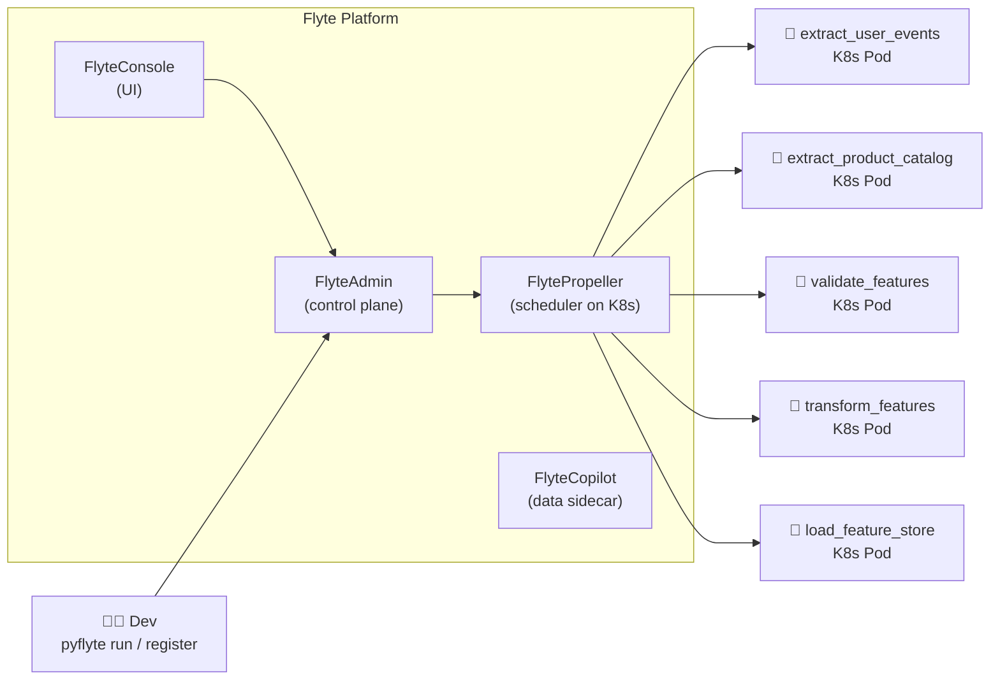
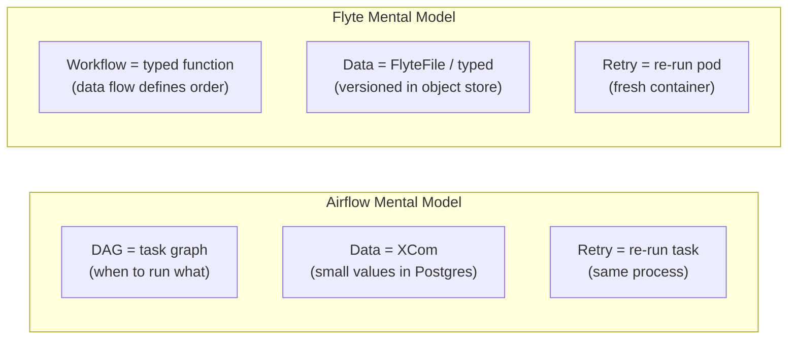

# Flyte – Best Practices for Product Recommendation

> Pipeline: `product_recommendation_feature_ingestion`  
> Comparison baseline: Airflow 2.8.1 (`dags/product_recs_feature.py`)  
> Flyte version: 1.x (flytekit ≥ 1.10)  
> Last updated: 2026-03-29

---

## Table of Contents

1. [What is Flyte?](#1-what-is-flyte)
2. [Core Concepts Mapped to the Feature ETL Pipeline](#2-core-concepts-mapped-to-the-feature-etl-pipeline)
3. [Implementing the Feature ETL Pipeline in Flyte](#3-implementing-the-feature-etl-pipeline-in-flyte)
4. [Best Practices](#4-best-practices)
5. [Flyte vs Airflow – Side-by-Side](#5-flyte-vs-airflow--side-by-side)
6. [Pros and Cons](#6-pros-and-cons)
7. [When to Choose Flyte over Airflow](#7-when-to-choose-flyte-over-airflow)
8. [Local → Flyte Migration Checklist](#8-local--flyte-migration-checklist)

---

## 1. What is Flyte?

Flyte is an open-source, **type-safe, ML-native workflow orchestrator** built by Lyft and
now governed by the Linux Foundation. It runs on Kubernetes and treats data pipelines as
**typed, versioned, reproducible workflows** rather than DAGs of shell commands.



**Key differentiators from Airflow:**
- Every task input/output is **strongly typed** and checked at compile time
- Data is automatically versioned and cached by content hash — re-running skips unchanged tasks
- Native support for ML-specific resources: GPUs, Spark clusters, Ray, Sagemaker
- No scheduler process to manage — runs on Kubernetes natively

---

## 2. Core Concepts Mapped to the Feature ETL Pipeline

| Flyte concept | Equivalent in Airflow | Used in feature ETL |
|---|---|---|
| `@task` | `@task` (PythonOperator) | `extract_user_events`, `validate_features`, etc. |
| `@workflow` | `@dag` | `product_recommendation_feature_ingestion` |
| `FlyteFile` / `FlyteDirectory` | XCom path string | Pass parquet files between tasks |
| `LaunchPlan` | DAG schedule + `catchup` | Daily `0 2 * * *` trigger |
| `ImageSpec` | Docker image in `docker-compose.yml` | Per-task container images |
| `Resources` | KubernetesPodOperator resource limits | CPU/memory per task |
| `CacheSerialization` | None in Airflow | Skip re-running tasks if inputs unchanged |
| `Map task` | Dynamic task mapping | Parallel feature extraction per entity type |

---

## 3. Implementing the Feature ETL Pipeline in Flyte

### Project structure

```
feature_etl/
  __init__.py
  tasks/
    extract.py       ← extract_user_events, extract_product_catalog
    validate.py      ← validate_features
    transform.py     ← transform_features
    load.py          ← load_feature_store
  workflows/
    feature_ingestion.py   ← product_recommendation_feature_ingestion workflow
  Dockerfile
  requirements.txt
```

### Task definitions

```python
# feature_etl/tasks/extract.py
import pandas as pd
from dataclasses import dataclass
from flytekit import task, Resources, ImageSpec
from flytekit.types.file import FlyteFile

# ✅ Pin the container image per task — each task can use a different image
extract_image = ImageSpec(
    name="feature-etl-extract",
    packages=["pandas==2.2.0", "pyarrow==15.0.0", "gcsfs==2024.2.0"],
    registry="gcr.io/my_project",
)

@dataclass
class ExtractResult:
    path: FlyteFile       # ✅ typed — not a raw string XCom like Airflow
    row_count: int
    entity_date: str

@task(
    container_image=extract_image,
    requests=Resources(cpu="1", mem="2Gi"),
    limits=Resources(cpu="2",  mem="4Gi"),
    cache=True,                  # ✅ skip if same inputs were already processed
    cache_version="1.0",
    retries=2,
)
def extract_user_events(execution_date: str) -> ExtractResult:
    """
    Pulls raw user interaction events (clicks, views, purchases)
    for the given execution_date from the source system.
    """
    print(f"[{execution_date}] Extracting user interaction events ...")
    # TODO: replace with real source (S3, Kafka, OLTP DB)
    output_path = f"gs://ml-feature-ingestion-bucket/raw/user_events_{execution_date}.parquet"
    row_count = 0  # placeholder
    return ExtractResult(
        path=FlyteFile(output_path),
        row_count=row_count,
        entity_date=execution_date,
    )

@task(
    container_image=extract_image,
    requests=Resources(cpu="1", mem="2Gi"),
    cache=True,
    cache_version="1.0",
    retries=2,
)
def extract_product_catalog(execution_date: str) -> ExtractResult:
    """
    Pulls the product catalogue snapshot for the given execution_date.
    """
    print(f"[{execution_date}] Extracting product catalogue snapshot ...")
    output_path = f"gs://ml-feature-ingestion-bucket/raw/product_catalog_{execution_date}.parquet"
    row_count = 0  # placeholder
    return ExtractResult(
        path=FlyteFile(output_path),
        row_count=row_count,
        entity_date=execution_date,
    )
```

```python
# feature_etl/tasks/validate.py
from dataclasses import dataclass
from flytekit import task, Resources
from flytekit.types.file import FlyteFile
from feature_etl.tasks.extract import ExtractResult

@dataclass
class ValidatedResult:
    user_events_path:     FlyteFile
    product_catalog_path: FlyteFile
    entity_date:          str
    user_row_count:       int
    product_row_count:    int

@task(
    requests=Resources(cpu="500m", mem="1Gi"),
    retries=2,
)
def validate_features(
    user_events: ExtractResult,
    product_catalog: ExtractResult,
) -> ValidatedResult:
    """
    Schema + data quality checks on extracted datasets.
    Raises ValueError if critical checks fail — triggers retry.
    Checks: non-empty, no null entity_id, price > 0.
    """
    if user_events.row_count == 0:
        raise ValueError(f"user_events is empty for {user_events.entity_date}")
    if product_catalog.row_count == 0:
        raise ValueError(f"product_catalog is empty for {product_catalog.entity_date}")
    # TODO: add Pandera / Great Expectations checks
    return ValidatedResult(
        user_events_path=user_events.path,
        product_catalog_path=product_catalog.path,
        entity_date=user_events.entity_date,
        user_row_count=user_events.row_count,
        product_row_count=product_catalog.row_count,
    )
```

```python
# feature_etl/tasks/transform.py
from dataclasses import dataclass
from flytekit import task, Resources
from flytekit.types.file import FlyteFile
from feature_etl.tasks.validate import ValidatedResult

transform_image = ImageSpec(
    name="feature-etl-transform",
    packages=["pandas==2.2.0", "pyarrow==15.0.0", "scikit-learn==1.4.0"],
    registry="gcr.io/my_project",
)

@dataclass
class TransformResult:
    path:       FlyteFile
    row_count:  int
    entity_date: str

@task(
    container_image=transform_image,
    requests=Resources(cpu="2", mem="8Gi"),    # heavier task — own resource budget
    limits=Resources(cpu="4",  mem="16Gi"),
    cache=True,
    cache_version="1.0",
    retries=2,
)
def transform_features(validated: ValidatedResult) -> TransformResult:
    """
    Joins user events with the product catalogue and computes
    derived recommendation features:
    - user_purchase_count_7d
    - user_category_affinity
    - product_popularity_score
    - product_co_view_rate
    """
    import pandas as pd
    ds = validated.entity_date
    print(f"[{ds}] Joining and computing derived features ...")
    # TODO: implement pandas / Spark join logic
    output_path = f"gs://ml-feature-ingestion-bucket/transformed/features_{ds}.parquet"
    return TransformResult(
        path=FlyteFile(output_path),
        row_count=0,   # placeholder
        entity_date=ds,
    )
```

```python
# feature_etl/tasks/load.py
from flytekit import task, Resources
from feature_etl.tasks.transform import TransformResult

@task(
    requests=Resources(cpu="500m", mem="1Gi"),
    retries=3,
)
def load_feature_store(transformed: TransformResult) -> None:
    """
    Upserts the transformed feature set into the feature store
    keyed by (entity_id, feature_date). Idempotent.
    """
    ds = transformed.entity_date
    print(f"[{ds}] Loading {transformed.row_count} features → feature store ...")
    # TODO: implement BigQuery MERGE or Redis pipeline write
    print(f"[{ds}] Load complete ✓")
```

### Workflow — wires all tasks together

```python
# feature_etl/workflows/feature_ingestion.py
from flytekit import workflow
from feature_etl.tasks.extract   import extract_user_events, extract_product_catalog
from feature_etl.tasks.validate  import validate_features
from feature_etl.tasks.transform import transform_features
from feature_etl.tasks.load      import load_feature_store

@workflow
def product_recommendation_feature_ingestion(execution_date: str = "2026-03-29") -> None:
    """
    Product Recommendation Feature Ingestion Pipeline.

    extract_user_events    ──┐
                             ├──► validate_features ──► transform_features ──► load_feature_store
    extract_product_catalog──┘
    """
    user_events     = extract_user_events(execution_date=execution_date)
    product_catalog = extract_product_catalog(execution_date=execution_date)

    # ✅ Flyte infers parallelism from data flow — no explicit >> syntax needed
    validated   = validate_features(user_events=user_events, product_catalog=product_catalog)
    transformed = transform_features(validated=validated)
    load_feature_store(transformed=transformed)
```

### Schedule with a LaunchPlan

```python
# feature_etl/workflows/feature_ingestion.py (continued)
from flytekit import LaunchPlan, CronSchedule
from datetime import datetime

# ✅ Equivalent to Airflow schedule_interval='0 2 * * *' + catchup=False
daily_launch_plan = LaunchPlan.get_or_create(
    name="daily_feature_ingestion",
    workflow=product_recommendation_feature_ingestion,
    schedule=CronSchedule(
        schedule="0 2 * * *",
        kickoff_time_input_arg="execution_date",
    ),
    fixed_inputs={"execution_date": datetime.utcnow().strftime("%Y-%m-%d")},
)
```

### Register and run

```bash
# Register the workflow and tasks with the Flyte cluster
pyflyte register feature_etl/ --project product-recs --domain production --version v1.0.0

# Run ad-hoc for a specific date
pyflyte run feature_etl/workflows/feature_ingestion.py \
  product_recommendation_feature_ingestion \
  --execution_date 2026-03-29

# Activate the daily schedule
pyflyte launchplan feature_etl/workflows/feature_ingestion.py \
  daily_feature_ingestion --activate
```

---

## 4. Best Practices

### ✅ Use typed dataclasses for task inputs/outputs
Avoid raw `dict` XComs (Airflow pattern). Flyte validates types at workflow compile time,
catching bugs before the pipeline runs.

```python
# ❌ Airflow pattern — no type safety
return {"path": "/tmp/data.parquet", "rows": 100, "date": "2026-03-29"}

# ✅ Flyte pattern — typed, IDE-autocomplete, validated at registration
@dataclass
class ExtractResult:
    path: FlyteFile
    row_count: int
    entity_date: str
```

### ✅ Use `FlyteFile` / `FlyteDirectory` for data passing
Flyte automatically manages upload/download of files to/from object storage.
Tasks never need to manage GCS paths manually.

```python
@task
def transform_features(validated: ValidatedResult) -> TransformResult:
    # ✅ Flyte downloads the file automatically before the task runs
    df = pd.read_parquet(validated.user_events_path)   # local path after download
    ...
    # ✅ Flyte uploads the output file automatically after the task completes
    return TransformResult(path=FlyteFile("/tmp/output.parquet"), ...)
```

### ✅ Enable task caching for expensive extract/transform tasks
If the same `execution_date` is re-run (retry, backfill), cached tasks are skipped.
Only tasks whose inputs changed are re-executed.

```python
@task(cache=True, cache_version="1.0")
def extract_user_events(execution_date: str) -> ExtractResult:
    ...
```

### ✅ Set `ImageSpec` per task — not one image for all
Extract tasks need `pandas + gcsfs`. Transform tasks may need `scikit-learn + spark`.
Separate images keep containers lean and build times fast.

```python
extract_image   = ImageSpec(packages=["pandas", "gcsfs"],      ...)
transform_image = ImageSpec(packages=["pandas", "scikit-learn"], ...)
```

### ✅ Set resource requests and limits per task
Flyte runs each task in its own Kubernetes pod. Over-provision and you waste cluster
resources; under-provision and tasks OOM-kill.

```python
@task(
    requests=Resources(cpu="2", mem="8Gi", gpu="0"),
    limits=Resources(cpu="4",  mem="16Gi"),
)
def transform_features(...): ...
```

### ✅ Use `map_task` for parallel entity-level feature extraction

```python
from flytekit import map_task

@task
def extract_entity_features(entity_id: str) -> FlyteFile: ...

@workflow
def parallel_feature_extraction(entity_ids: list[str]) -> list[FlyteFile]:
    # ✅ Runs one pod per entity_id — no manual fan-out logic
    return map_task(extract_entity_features)(entity_id=entity_ids)
```

### ✅ Use `conditional` for data-quality branching

```python
from flytekit import conditional

@workflow
def feature_ingestion_with_quality_gate(execution_date: str) -> None:
    validated = validate_features(...)
    result = (
        conditional("quality_gate")
        .if_(validated.user_row_count > 0)
        .then(transform_features(validated=validated))
        .else_()
        .fail("Validation failed: empty user events dataset")
    )
```

### ✅ Version every workflow registration

```bash
# ✅ Semantic versioning — enables safe rollback
pyflyte register feature_etl/ --version v1.2.0

# Roll back to previous version without redeploying code
pyflyte execution create --version v1.1.0 \
  product_recommendation_feature_ingestion
```

### ✅ Use `flytekit` secrets for credentials — not env vars

```python
from flytekit import Secret, task

@task(
    secret_requests=[
        Secret(group="feature-store", key="redis_password"),
        Secret(group="feature-store", key="bq_service_account"),
    ]
)
def load_feature_store(transformed: TransformResult) -> None:
    from flytekit import current_context
    redis_pw = current_context().secrets.get("feature-store", "redis_password")
    ...
```

---

## 5. Flyte vs Airflow – Side-by-Side

### Feature ETL pipeline implementation

| Aspect | Airflow (`product_recs_feature.py`) | Flyte (`feature_ingestion.py`) |
|---|---|---|
| **Orchestration model** | DAG of operators | Typed workflow of tasks |
| **Task definition** | `@task` decorator (PythonOperator) | `@task` decorator (typed) |
| **Data passing** | `dict` via XCom (stored in Postgres) | `FlyteFile` / typed dataclass (stored in S3/GCS) |
| **Type safety** | ❌ None — runtime errors only | ✅ Compile-time type checking |
| **Dependency wiring** | `>>` operator or function call return | Automatic from data flow |
| **Parallelism** | Explicit `[t1, t2]` fan-out | Inferred from data dependencies |
| **Caching** | ❌ No built-in task caching | ✅ Content-hash based cache |
| **Container per task** | ❌ Shared worker process | ✅ Isolated Kubernetes pod per task |
| **Resource control** | `KubernetesPodOperator` only | Native `Resources(cpu, mem, gpu)` on every `@task` |
| **Scheduling** | `schedule_interval` cron | `LaunchPlan` + `CronSchedule` |
| **Backfill** | `airflow dags backfill` CLI | Re-run with `execution_date` param |
| **Versioning** | File-level (git) | Workflow + task version registered in FlyteAdmin |
| **Retry logic** | `default_args.retries` | Per-task `retries` param |
| **Secrets** | Airflow Connections / Variables | `flytekit.Secret` + K8s secrets backend |
| **UI** | Airflow Webserver (port 8080) | FlyteConsole (port 30081) |
| **Local execution** | `airflow tasks test` | `pyflyte run` |

### Mental model



---

## 6. Pros and Cons

### Flyte Pros

| | Details |
|---|---|
| ✅ **Type safety** | All task I/O typed and validated at registration — catches bugs before runtime |
| ✅ **Task-level caching** | Re-runs skip unchanged tasks — crucial for iterative ML development |
| ✅ **Native ML support** | First-class `SparkTask`, `RayTask`, `SagemakerTask`, GPU resources |
| ✅ **Isolated containers** | Each task runs in its own pod — no noisy-neighbour worker processes |
| ✅ **Versioned executions** | Every run is tied to a registered workflow version — fully reproducible |
| ✅ **Data lineage** | FlyteAdmin tracks which data artifact came from which task version |
| ✅ **Cloud-agnostic** | Runs on any Kubernetes cluster — GKE, EKS, AKS, on-prem |
| ✅ **`map_task`** | Native parallelism over lists — no dynamic DAG workarounds |
| ✅ **Open-source + CNCF** | No vendor lock-in — self-hosted or Union.ai managed |

### Flyte Cons

| | Details |
|---|---|
| ❌ **Steeper learning curve** | Typed dataclasses, `FlyteFile`, `ImageSpec` — more concepts than Airflow |
| ❌ **Kubernetes required** | Needs a running K8s cluster — heavier local dev setup than Docker Compose |
| ❌ **Smaller ecosystem** | Fewer pre-built integrations than Airflow's 700+ provider operators |
| ❌ **Cold start latency** | Pod spin-up per task adds ~10–30s — bad for sub-minute pipelines |
| ❌ **Build overhead** | `ImageSpec` requires building/pushing Docker images per task change |
| ❌ **Less mature scheduling** | LaunchPlans less feature-rich than Airflow's scheduling (no SLA callbacks) |
| ❌ **Smaller community** | Fewer tutorials, Stack Overflow answers, and third-party plugins |

---

## 7. When to Choose Flyte over Airflow

| Choose **Flyte** when | Choose **Airflow** when |
|---|---|
| Pipeline inputs/outputs are large files (parquet, models) | Pipeline is primarily task orchestration with small data |
| Data scientists iterate frequently — caching saves hours | Engineers manage infra — Airflow's UI and ecosystem are familiar |
| You need GPU tasks or Spark jobs natively | You need 700+ pre-built operator integrations |
| Reproducibility and data lineage are critical | You need mature SLA, catchup, and backfill scheduling |
| Team is comfortable with Kubernetes | Team runs on Docker Compose or Cloud Composer |
| You want task-level container isolation | Shared worker processes are acceptable |

**For this pipeline specifically:**  
Use **Airflow (current)** for the orchestration layer and **Flyte** if/when you add model
training steps that need GPU resources, large dataset caching, or per-experiment reproducibility.

---

## 8. Local → Flyte Migration Checklist

| # | Item | Status | Notes |
|---|---|---|---|
| 1 | Replace `dict` XComs with typed `@dataclass` | ❌ Todo | `ExtractResult`, `ValidatedResult`, `TransformResult` |
| 2 | Replace `/tmp/` paths with `FlyteFile` (GCS-backed) | ❌ Todo | Critical — same as Composer migration |
| 3 | Define `ImageSpec` per task group | ❌ Todo | `extract_image`, `transform_image` |
| 4 | Set `Resources(cpu, mem)` per task | ❌ Todo | Especially `transform_features` |
| 5 | Enable `cache=True` on extract + transform tasks | ❌ Todo | Saves re-processing on retries |
| 6 | Replace `default_args.retries` with per-task `retries=` | ⚠️ Todo | Already have retry logic — port it |
| 7 | Replace Airflow `LaunchPlan` with Flyte `LaunchPlan` | ❌ Todo | Preserve `0 2 * * *` cron |
| 8 | Replace Airflow Connections with `flytekit.Secret` | ❌ Todo | `redis_password`, `feature_store_db` |
| 9 | Replace placeholder `print` stubs with real logic | ❌ Todo | Same as Composer migration |
| 10 | Add `pytest` tests using `flytekit.testing` | ❌ Todo | Unit-test tasks locally without K8s |
| 11 | Deploy Flyte on GKE or use Union.ai cloud | ❌ Todo | Infra prerequisite |

