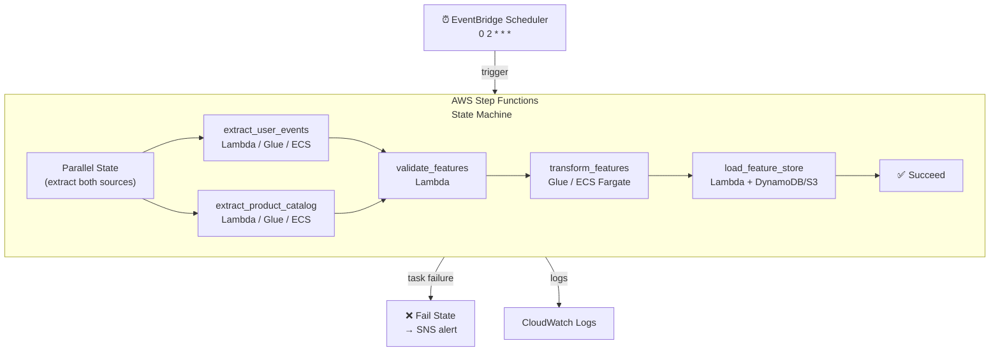
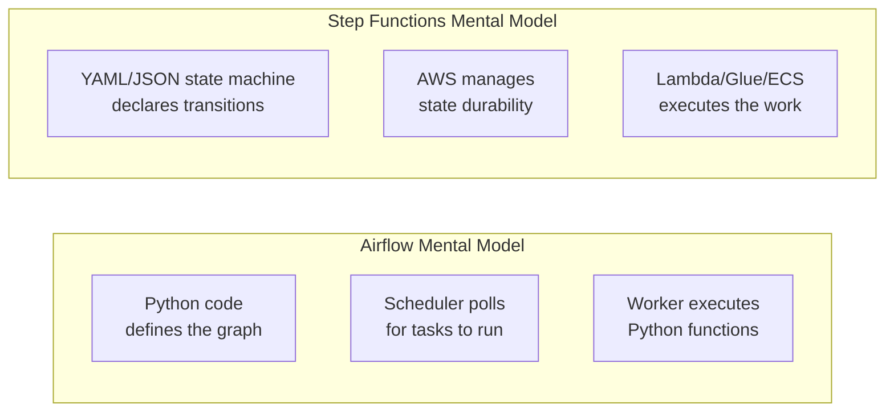
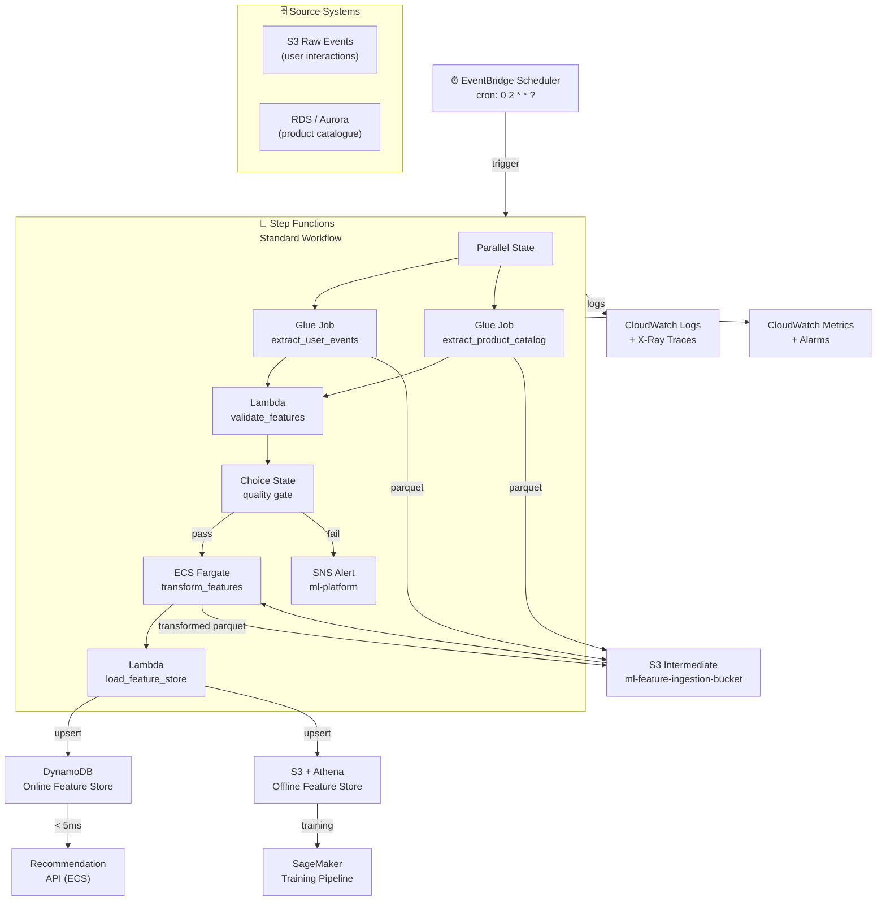
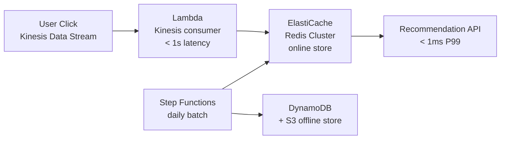

# AWS Step Functions – Feature ETL Best Practices for Product Recommendation

> Pipeline: `product_recommendation_feature_ingestion`  
> Comparison baseline: Airflow 2.8.1 (`dags/product_recs_feature.py`)  
> AWS services used: Step Functions · Lambda · Glue · ECS Fargate · EventBridge  
> Designed for **high-throughput, low-latency** systems at Amazon scale —  
> 10B+ events/day · 500M+ entities · < 10 ms online serving SLA  
> Last updated: 2026-03-29

---

## Table of Contents

1. [What is AWS Step Functions?](#1-what-is-aws-step-functions)
2. [Core Concepts Mapped to the Feature ETL Pipeline](#2-core-concepts-mapped-to-the-feature-etl-pipeline)
3. [Implementing the Feature ETL Pipeline in Step Functions](#3-implementing-the-feature-etl-pipeline-in-step-functions)
4. [Best Practices](#4-best-practices)
5. [Step Functions vs Airflow – Side-by-Side](#5-step-functions-vs-airflow--side-by-side)
6. [Pros and Cons](#6-pros-and-cons)
7. [When to Choose Step Functions over Airflow](#7-when-to-choose-step-functions-over-airflow)
8. [AWS Architecture for Feature ETL](#8-aws-architecture-for-feature-etl)
9. [Migration Checklist (Airflow → Step Functions)](#9-migration-checklist-airflow--step-functions)

---

## 1. What is AWS Step Functions?

AWS Step Functions is a **serverless workflow orchestrator** that coordinates AWS services
using a JSON/YAML state machine definition (Amazon States Language — ASL). There is no
scheduler process, no worker fleet to manage, and no infrastructure to patch.



**Key differentiators from Airflow:**
- **Serverless** — no scheduler, no worker, no infrastructure to manage
- State machine execution is **durable** — survives Lambda timeouts, network blips, and restarts
- Native **wait states** — pause for hours/days for async processes (e.g. Glue job, SageMaker training)
- Execution history stored for 90 days — full input/output at every step

---

## 2. Core Concepts Mapped to the Feature ETL Pipeline

| Step Functions concept | Equivalent in Airflow | Used in feature ETL |
|---|---|---|
| **State Machine** | DAG | `product_recommendation_feature_ingestion` |
| **Task state** | `@task` / operator | `extract_user_events`, `validate_features`, etc. |
| **Parallel state** | `[t1, t2]` fan-out | Run both extract tasks simultaneously |
| **Pass state** | `EmptyOperator` | Merge parallel branches, pass data forward |
| **Choice state** | `BranchPythonOperator` | Route on validation result |
| **Wait state** | `ExternalTaskSensor` | Wait for async Glue job / SageMaker run |
| **Fail state** | `on_failure_callback` | Terminate + alert on error |
| **`$.` path expressions** | XCom | Pass data between states |
| **EventBridge Scheduler** | `schedule_interval` cron | `0 2 * * *` daily trigger |
| **Step Functions Express** | Short-duration DAG | For < 5-min pipelines |
| **Step Functions Standard** | Long-running DAG | For > 5-min pipelines (up to 1 year) |

---

## 3. Implementing the Feature ETL Pipeline in Step Functions

### State machine definition (ASL — YAML)

```yaml
# feature_ingestion_state_machine.asl.yaml
Comment: "Product Recommendation Feature Ingestion Pipeline"
StartAt: ExtractFeatures

States:

  # ── Parallel extract ──────────────────────────────────────────────────────
  ExtractFeatures:
    Type: Parallel
    Comment: "Extract user events and product catalogue simultaneously"
    Branches:
      - StartAt: ExtractUserEvents
        States:
          ExtractUserEvents:
            Type: Task
            Resource: "arn:aws:states:::glue:startJobRun.sync"
            Parameters:
              JobName: "extract-user-events"
              Arguments:
                "--execution_date.$": "$.execution_date"
                "--output_bucket":    "s3://ml-feature-ingestion-bucket/raw/"
            ResultPath: "$.user_events"
            Retry:
              - ErrorEquals: ["States.TaskFailed"]
                IntervalSeconds: 30
                MaxAttempts: 2
                BackoffRate: 2.0
            End: true

      - StartAt: ExtractProductCatalog
        States:
          ExtractProductCatalog:
            Type: Task
            Resource: "arn:aws:states:::glue:startJobRun.sync"
            Parameters:
              JobName: "extract-product-catalog"
              Arguments:
                "--execution_date.$": "$.execution_date"
                "--output_bucket":    "s3://ml-feature-ingestion-bucket/raw/"
            ResultPath: "$.product_catalog"
            Retry:
              - ErrorEquals: ["States.TaskFailed"]
                IntervalSeconds: 30
                MaxAttempts: 2
                BackoffRate: 2.0
            End: true

    ResultSelector:
      user_events.$:     "$[0].user_events"
      product_catalog.$: "$[1].product_catalog"
    ResultPath: "$.extracted"
    Next: ValidateFeatures

  # ── Validate ─────────────────────────────────────────────────────────────
  ValidateFeatures:
    Type: Task
    Resource: "arn:aws:states:::lambda:invoke"
    Parameters:
      FunctionName: "validate-features"
      Payload:
        user_events.$:     "$.extracted.user_events"
        product_catalog.$: "$.extracted.product_catalog"
        execution_date.$:  "$.execution_date"
    ResultPath: "$.validated"
    Retry:
      - ErrorEquals: ["Lambda.ServiceException", "Lambda.AWSLambdaException"]
        IntervalSeconds: 10
        MaxAttempts: 2
    Catch:
      - ErrorEquals: ["ValidationError"]
        ResultPath: "$.error"
        Next: FeatureIngestionFailed
    Next: CheckValidation

  # ── Quality gate ─────────────────────────────────────────────────────────
  CheckValidation:
    Type: Choice
    Choices:
      - Variable:   "$.validated.passed"
        BooleanEquals: true
        Next: TransformFeatures
    Default: FeatureIngestionFailed

  # ── Transform ────────────────────────────────────────────────────────────
  TransformFeatures:
    Type: Task
    Resource: "arn:aws:states:::ecs:runTask.sync"
    Comment: "Run on ECS Fargate for heavier pandas/Spark transforms"
    Parameters:
      LaunchType: "FARGATE"
      Cluster:    "arn:aws:ecs:us-east-1:123456789:cluster/ml-feature-cluster"
      TaskDefinition: "feature-transform:latest"
      Overrides:
        ContainerOverrides:
          - Name: "transform"
            Environment:
              - Name:  "EXECUTION_DATE"
                Value.$: "$.execution_date"
              - Name:  "INPUT_PATH"
                Value.$: "$.extracted.user_events.output_path"
    ResultPath: "$.transformed"
    Retry:
      - ErrorEquals: ["States.TaskFailed"]
        IntervalSeconds: 60
        MaxAttempts: 2
        BackoffRate: 2.0
    Next: LoadFeatureStore

  # ── Load ─────────────────────────────────────────────────────────────────
  LoadFeatureStore:
    Type: Task
    Resource: "arn:aws:states:::lambda:invoke"
    Parameters:
      FunctionName: "load-feature-store"
      Payload:
        transformed.$:    "$.transformed"
        execution_date.$: "$.execution_date"
    ResultPath: "$.loaded"
    Retry:
      - ErrorEquals: ["Lambda.ServiceException"]
        IntervalSeconds: 30
        MaxAttempts: 3
        BackoffRate: 2.0
    Next: FeatureIngestionSucceeded

  # ── Terminal states ───────────────────────────────────────────────────────
  FeatureIngestionSucceeded:
    Type: Succeed

  FeatureIngestionFailed:
    Type: Task
    Resource: "arn:aws:states:::sns:publish"
    Parameters:
      TopicArn: "arn:aws:sns:us-east-1:123456789:ml-platform-alerts"
      Message:
        Input.$: "States.Format('Feature ingestion failed on {}. Error: {}', $.execution_date, $.error)"
    Next: PipelineFailed

  PipelineFailed:
    Type: Fail
    Error:   "FeatureIngestionError"
    Cause:   "Feature ingestion pipeline failed — see CloudWatch logs"
```

### Lambda — `validate_features`

```python
# lambdas/validate_features/handler.py
import json

def handler(event, context):
    user_events     = event['user_events']
    product_catalog = event['product_catalog']
    execution_date  = event['execution_date']

    errors = []
    if user_events.get('row_count', 0) == 0:
        errors.append(f"user_events empty for {execution_date}")
    if product_catalog.get('row_count', 0) == 0:
        errors.append(f"product_catalog empty for {execution_date}")

    if errors:
        raise Exception(json.dumps({"type": "ValidationError", "errors": errors}))

    return {
        "passed":             True,
        "user_row_count":     user_events['row_count'],
        "product_row_count":  product_catalog['row_count'],
        "execution_date":     execution_date,
    }
```

### Glue job — `extract_user_events`

```python
# glue/extract_user_events.py
import sys
from awsglue.utils import getResolvedOptions
from pyspark.context import SparkContext
from awsglue.context import GlueContext

args            = getResolvedOptions(sys.argv, ['execution_date', 'output_bucket'])
execution_date  = args['execution_date']
output_bucket   = args['output_bucket']

sc           = SparkContext()
glue_context = GlueContext(sc)
spark        = glue_context.spark_session

# TODO: replace with real source query
df = spark.sql(f"""
    SELECT user_id, event_type, product_id, timestamp
    FROM user_events_db.interactions
    WHERE DATE(timestamp) = '{execution_date}'
""")

output_path = f"{output_bucket}user_events_{execution_date}"
df.write.mode("overwrite").parquet(output_path)

print(f"[{execution_date}] Extracted {df.count()} user events → {output_path}")
```

### Trigger with EventBridge Scheduler

```bash
# ✅ Equivalent to Airflow schedule_interval='0 2 * * *'
aws scheduler create-schedule \
  --name daily-feature-ingestion \
  --schedule-expression "cron(0 2 * * ? *)" \
  --flexible-time-window '{"Mode": "OFF"}' \
  --target '{
    "Arn": "arn:aws:states:us-east-1:123456789:stateMachine:feature-ingestion",
    "RoleArn": "arn:aws:iam::123456789:role/EventBridgeStepFunctionsRole",
    "Input": "{\"execution_date\": \"<aws.scheduler.scheduled-time>\"}"
  }'
```

### Deploy with AWS CDK (Infrastructure as Code)

```python
# cdk/feature_ingestion_stack.py
from aws_cdk import (
    aws_stepfunctions as sfn,
    aws_stepfunctions_tasks as tasks,
    aws_events as events,
    aws_events_targets as targets,
    aws_lambda as _lambda,
    Stack,
)

class FeatureIngestionStack(Stack):
    def __init__(self, scope, id, **kwargs):
        super().__init__(scope, id, **kwargs)

        # Lambda — validate
        validate_fn = _lambda.Function(
            self, "ValidateFeatures",
            runtime=_lambda.Runtime.PYTHON_3_11,
            handler="handler.handler",
            code=_lambda.Code.from_asset("lambdas/validate_features"),
        )

        # State machine from ASL file
        state_machine = sfn.StateMachine(
            self, "FeatureIngestion",
            definition_body=sfn.DefinitionBody.from_file(
                "feature_ingestion_state_machine.asl.yaml"
            ),
            state_machine_type=sfn.StateMachineType.STANDARD,
            tracing_enabled=True,       # ✅ X-Ray tracing
            logs=sfn.LogOptions(
                destination=log_group,
                level=sfn.LogLevel.ALL,  # ✅ log all state transitions
            ),
        )

        # EventBridge — daily trigger at 02:00 UTC
        events.Rule(
            self, "DailyTrigger",
            schedule=events.Schedule.cron(hour="2", minute="0"),
            targets=[targets.SfnStateMachine(state_machine)],
        )
```

---

## 4. Best Practices

### ✅ Use Standard Workflows for feature ETL (not Express)
Standard Workflows support executions up to 1 year and store full execution history.
Express Workflows are cheaper but limited to 5 minutes with at-least-once semantics.

| Type | Max duration | Semantics | Best for |
|---|---|---|---|
| **Standard** | 1 year | Exactly-once | Feature ETL, model training |
| **Express** | 5 minutes | At-least-once | Event streams, real-time scoring |

### ✅ Use `$.` JSONPath for passing data between states
Keep state output small — pass S3 paths, not file contents.

```yaml
# ✅ Pass S3 path reference — small payload, safe for state history
ResultSelector:
  output_path.$: "$.JobRun.Arguments.--output_path"
  row_count.$:   "$.JobRun.Statistics.DPUSeconds"

# ❌ Never embed large data in state output — Step Functions has a 256KB payload limit
```

### ✅ Always add `Retry` with exponential backoff

```yaml
Retry:
  - ErrorEquals: ["States.TaskFailed", "Lambda.ServiceException"]
    IntervalSeconds: 30      # wait 30s before first retry
    MaxAttempts: 3
    BackoffRate: 2.0         # 30s → 60s → 120s
    MaxDelaySeconds: 300     # cap at 5 minutes
```

### ✅ Add `Catch` for expected errors — route to a Fail state with SNS alert

```yaml
Catch:
  - ErrorEquals: ["ValidationError"]
    ResultPath: "$.error"
    Next: FeatureIngestionFailed
```

### ✅ Use `Choice` state for data quality gates
Avoid raising exceptions just to branch — use `Choice` states for conditional logic.

```yaml
CheckValidation:
  Type: Choice
  Choices:
    - Variable: "$.validated.passed"
      BooleanEquals: true
      Next: TransformFeatures
  Default: FeatureIngestionFailed
```

### ✅ Use `.sync` integrations for long-running jobs
Without `.sync`, Step Functions fires a job and moves on immediately.
With `.sync`, it polls until the job completes — essential for Glue and ECS.

```yaml
# ✅ Wait for Glue job to finish before proceeding
Resource: "arn:aws:states:::glue:startJobRun.sync"

# ✅ Wait for ECS task to finish before proceeding
Resource: "arn:aws:states:::ecs:runTask.sync"

# ❌ Fire-and-forget — pipeline continues before job finishes
Resource: "arn:aws:states:::glue:startJobRun"
```

### ✅ Enable X-Ray tracing and CloudWatch logging

```python
# CDK — enable both at state machine creation
state_machine = sfn.StateMachine(
    ...
    tracing_enabled=True,
    logs=sfn.LogOptions(
        destination=log_group,
        level=sfn.LogLevel.ALL,
    ),
)
```

### ✅ Use Parameter Store / Secrets Manager — never hardcode ARNs or credentials

```yaml
# ✅ Reference SSM Parameter at deploy time via CDK/CloudFormation
FunctionName: !Sub "arn:aws:lambda:${AWS::Region}:${AWS::AccountId}:function:validate-features"
```

```python
# ✅ In Lambda — fetch secrets at cold start, cache in memory
import boto3, json
_secret = None

def get_secret():
    global _secret
    if _secret is None:
        client  = boto3.client('secretsmanager')
        resp    = client.get_secret_value(SecretId='ml/feature-store/redis')
        _secret = json.loads(resp['SecretString'])
    return _secret
```

### ✅ Idempotent Lambda and Glue jobs — safe to retry

```python
# ✅ load_feature_store Lambda — upsert, not insert
def handler(event, context):
    ds = event['execution_date']
    # DynamoDB conditional write — idempotent
    table.put_item(
        Item={"entity_id": entity_id, "feature_date": ds, **features},
        ConditionExpression="attribute_not_exists(entity_id) OR feature_date = :ds",
        ExpressionAttributeValues={":ds": ds},
    )
```

### ✅ Tag all Step Functions resources for cost allocation

```python
# CDK tagging
from aws_cdk import Tags
Tags.of(self).add("project",     "product-recommendation")
Tags.of(self).add("pipeline",    "feature-ingestion")
Tags.of(self).add("environment", "production")
Tags.of(self).add("owner",       "ml-platform")
```

---

## 5. Step Functions vs Airflow – Side-by-Side

| Aspect | Airflow (`product_recs_feature.py`) | Step Functions (ASL) |
|---|---|---|
| **Orchestration model** | Python DAG — code defines graph | JSON/YAML state machine — declarative |
| **Infrastructure** | Scheduler + workers (Docker / Composer) | Fully serverless — no infra to manage |
| **Task execution** | Python process / K8s pod | Lambda / Glue / ECS / SageMaker |
| **Scheduling** | `schedule_interval` cron (built-in) | EventBridge Scheduler (separate service) |
| **Parallelism** | `[t1, t2]` or `max_active_tasks` | `Parallel` state — native |
| **Branching** | `BranchPythonOperator` | `Choice` state |
| **Wait for async job** | `Sensor` (polls, uses worker slot) | `.sync` integration (serverless polling) |
| **Data passing** | XCom dict (Postgres, 64KB limit) | JSONPath `$` (256KB limit) |
| **Retry** | `default_args.retries` | Per-state `Retry` with backoff |
| **Error handling** | `on_failure_callback` | `Catch` → route to Fail/alert state |
| **Observability** | Airflow UI + logs | Step Functions console + CloudWatch + X-Ray |
| **Versioning** | Git + DAG file | State machine versions via `PublishVersion` |
| **Cost model** | Always-on infra cost | Per-state-transition ($0.025 / 1K transitions) |
| **Max execution time** | Unlimited | Standard: 1 year / Express: 5 min |
| **Code language** | Python | ASL (JSON/YAML) + Lambda (any language) |
| **Ecosystem** | 700+ provider operators | AWS services only |
| **Cross-cloud** | ✅ Any cloud / on-prem | ❌ AWS only |

### Mental model



---

## 6. Pros and Cons

### Step Functions Pros

| | Details |
|---|---|
| ✅ **Truly serverless** | Zero infrastructure — no scheduler, no worker fleet, no patching |
| ✅ **Durable execution** | State persists through Lambda timeouts, restarts, network failures |
| ✅ **Native AWS integration** | First-class support for Glue, ECS, SageMaker, Lambda, DynamoDB |
| ✅ **Visual workflow editor** | Drag-and-drop state machine design in AWS console |
| ✅ **Built-in retry + catch** | Exponential backoff and error routing in the state definition |
| ✅ **`.sync` wait states** | Pause for hours on Glue / SageMaker without consuming a worker slot |
| ✅ **90-day execution history** | Full input/output at every step — built-in audit trail |
| ✅ **No cold-start for orchestration** | No scheduler process to start — sub-second trigger |
| ✅ **Cost-efficient at low volume** | First 4,000 state transitions/month free — cheap for daily pipelines |

### Step Functions Cons

| | Details |
|---|---|
| ❌ **ASL learning curve** | JSON/YAML state machine syntax is verbose and error-prone |
| ❌ **AWS lock-in** | Cannot run on GCP, Azure, or on-prem |
| ❌ **256KB payload limit** | State output cannot exceed 256KB — must use S3/DynamoDB for large data |
| ❌ **No Python DAG** | Business logic lives in Lambda/Glue — not co-located with the workflow definition |
| ❌ **Debugging is harder** | Step through JSON state transitions vs reading Python tracebacks |
| ❌ **No built-in scheduling** | Requires EventBridge Scheduler as a separate service |
| ❌ **Limited dynamic parallelism** | `Map` state parallelism capped at 40 concurrent iterations by default |
| ❌ **No catch-up / backfill** | No built-in equivalent to `airflow dags backfill` — must trigger manually |
| ❌ **Ecosystem** | Only integrates with AWS services — no GCP BigQuery, Redis, etc. natively |

---

## 7. When to Choose Step Functions over Airflow

| Choose **Step Functions** when | Choose **Airflow** when |
|---|---|
| Entire stack is AWS-native (Glue, Lambda, ECS, SageMaker) | Stack spans GCP, Azure, or on-prem |
| You want zero infrastructure to manage | Team already runs Airflow / Composer |
| Pipeline has long async waits (Glue jobs, SageMaker training) | You need complex scheduling (SLA, catchup, backfill) |
| Sub-minute orchestration latency matters | You need 700+ pre-built operator integrations |
| You need durable, exactly-once workflow execution | Data scientists prefer Python-native workflow definitions |
| Cost per execution matters more than always-on cost | High-frequency pipelines where per-transition cost adds up |

**For this pipeline specifically:**  
Keep **Airflow** if the team is on GCP (Composer). Use **Step Functions** if you migrate the
feature pipeline to AWS (S3, Glue, DynamoDB/ElastiCache as feature store).

---

## 8. AWS Architecture for Feature ETL



---

## 9. Migration Checklist (Airflow → Step Functions)

| # | Item | Status | Notes |
|---|---|---|---|
| 1 | Map each `@task` to a Lambda / Glue / ECS task state | ❌ Todo | See §2 concept mapping table |
| 2 | Replace `[t1, t2]` parallel extract with `Parallel` state | ❌ Todo | Preserve parallel execution |
| 3 | Replace `validate_features` with Lambda + `Choice` quality gate | ❌ Todo | Add `ValidationError` catch |
| 4 | Replace `transform_features` with ECS Fargate task (`.sync`) | ❌ Todo | Needs task definition + cluster |
| 5 | Replace `load_feature_store` with Lambda + DynamoDB/S3 upsert | ❌ Todo | Preserve idempotency |
| 6 | Replace `schedule_interval` with EventBridge Scheduler | ❌ Todo | Preserve `cron(0 2 * * ? *)` |
| 7 | Replace email alert with SNS + Fail state | ❌ Todo | Replace `email_on_failure=True` |
| 8 | Replace Airflow retries with per-state `Retry` + backoff | ❌ Todo | Preserve `retries=2` logic |
| 9 | Replace `/tmp/` paths with S3 paths | ❌ Todo | Same as Composer/Flyte migration |
| 10 | Replace Airflow Connections with Secrets Manager | ❌ Todo | `feature_store_db`, Redis creds |
| 11 | Enable X-Ray tracing + CloudWatch logging | ❌ Todo | Observability parity with Airflow UI |
| 12 | Deploy state machine via CDK / Terraform | ❌ Todo | IaC for reproducible deployments |
| 13 | Implement manual backfill trigger script | ❌ Todo | No built-in backfill like Airflow |
| 14 | Add CloudWatch alarms for failed executions | ❌ Todo | Replace Airflow SLA monitoring |

---

## 10. High-Throughput & Low-Latency Patterns in Step Functions

### ✅ Use `Map` state for parallel hourly extraction at 10B+ events/day

```yaml
ExtractHourlyEvents:
  Type: Map
  ItemsPath: "$.hours"         # [0, 1, 2, ..., 23]
  MaxConcurrency: 24           # 24 parallel Glue jobs, one per hour
  Iterator:
    StartAt: ExtractHour
    States:
      ExtractHour:
        Type: Task
        Resource: "arn:aws:states:::glue:startJobRun.sync"
        Parameters:
          JobName: "extract-user-events-hourly"
          Arguments:
            "--execution_date.$": "$.execution_date"
            "--hour.$":           "$.hour"
  ResultPath: "$.hourly_results"
  Next: ValidateFeatures
```

### ✅ Use Glue with auto-scaling DPUs for large transforms

```yaml
TransformFeatures:
  Type: Task
  Resource: "arn:aws:states:::glue:startJobRun.sync"
  Parameters:
    JobName: "transform-features"
    Arguments:
      "--execution_date.$": "$.execution_date"
    MaxCapacity: 100          # Glue DPUs — scales with data size
    WorkerType: "G.2X"        # 8 vCPUs, 32 GB RAM per worker
    NumberOfWorkers: 50       # 50 workers × 8 vCPUs = 400 vCPUs total
  Retry:
    - ErrorEquals: ["States.TaskFailed"]
      IntervalSeconds: 60
      MaxAttempts: 2
      BackoffRate: 2.0
```

### ✅ Write to DynamoDB with `TransactWriteItems` for atomic upserts

```python
# Lambda — load_feature_store
import boto3

dynamodb = boto3.client('dynamodb')

def handler(event, context):
    ds      = event['execution_date']
    items   = event['transformed']['items']   # list of feature dicts

    # ✅ Batch write in chunks of 25 (DynamoDB TransactWriteItems limit)
    for chunk in [items[i:i+25] for i in range(0, len(items), 25)]:
        dynamodb.transact_write_items(
            TransactItems=[
                {
                    'Put': {
                        'TableName': 'product_rec_features',
                        'Item': {
                            'entity_id':           {'S': item['entity_id']},
                            'feature_date':        {'S': ds},
                            'purchase_count_7d':   {'N': str(item['purchase_count_7d'])},
                            'category_affinity':   {'N': str(item['category_affinity'])},
                            'popularity_score':    {'N': str(item['popularity_score'])},
                            'co_view_rate':        {'N': str(item['co_view_rate'])},
                            'ingested_at':         {'S': datetime.utcnow().isoformat()},
                        },
                        'ConditionExpression': 'attribute_not_exists(entity_id) OR feature_date = :ds',
                        'ExpressionAttributeValues': {':ds': {'S': ds}},
                    }
                }
                for item in chunk
            ]
        )
```

### ✅ Use ElastiCache (Redis Cluster) for < 1 ms online serving

```python
# Lambda — materialise_online_store (runs after load_feature_store)
import redis

r = redis.RedisCluster(
    startup_nodes=[{"host": os.environ["REDIS_HOST"], "port": 6379}],
    decode_responses=True,
    skip_full_coverage_check=True,
)

def handler(event, context):
    items = event['transformed']['items']
    pipe  = r.pipeline(transaction=False)
    for item in items:
        key = f"user:{item['entity_id']}:features"
        pipe.hset(key, mapping=item)
        pipe.expire(key, 172800)   # 48h TTL
        if len(pipe) >= 10_000:
            pipe.execute()
            pipe = r.pipeline(transaction=False)
    pipe.execute()
```

### ✅ Add a streaming lane with Kinesis + Lambda for near-realtime features



### ✅ Set CloudWatch alarms on DynamoDB and ElastiCache for SLA enforcement

```bash
# Alert if DynamoDB write latency exceeds 10ms
aws cloudwatch put-metric-alarm \
  --alarm-name "feature-store-write-latency" \
  --metric-name SuccessfulRequestLatency \
  --namespace AWS/DynamoDB \
  --dimensions Name=TableName,Value=product_rec_features \
               Name=Operation,Value=PutItem \
  --statistic p99 \
  --threshold 10 \
  --comparison-operator GreaterThanThreshold \
  --evaluation-periods 3 \
  --period 60 \
  --alarm-actions arn:aws:sns:us-east-1:123456789:ml-platform-alerts
```

