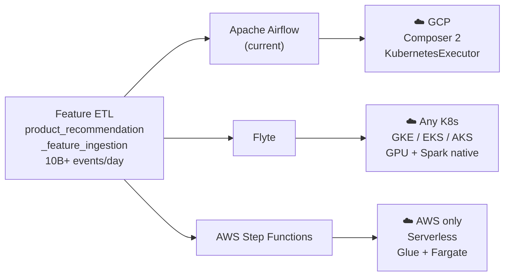
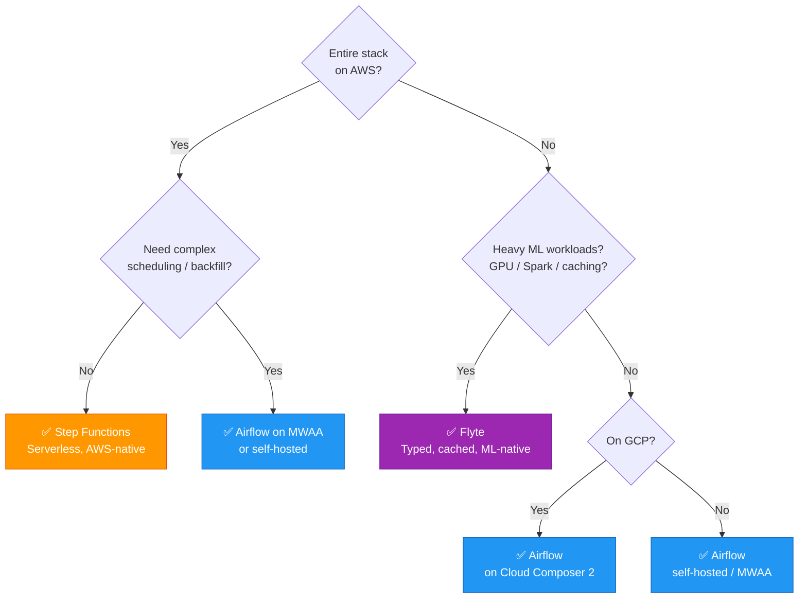

# Orchestrator Comparison – Airflow vs Flyte vs Step Functions
## Feature ETL for Product Recommendation

> Designed for **high-throughput, low-latency** systems at Google / Amazon scale  
> 10B+ events/day · 500M+ entities · < 10 ms online serving SLA  
> Last updated: 2026-03-29

---

---

## At a Glance

| Dimension | Airflow 2.8 | Flyte 1.x | Step Functions |
|---|---|---|---|
| **Paradigm** | Task graph (DAG) | Typed workflow (data flow) | Declarative state machine |
| **Language** | Python | Python | ASL (JSON/YAML) + Lambda |
| **Infrastructure** | Scheduler + workers | Kubernetes (pods per task) | Serverless (no infra) |
| **Type safety** | ❌ None | ✅ Compile-time | ⚠️ JSON schema only |
| **Task caching** | ❌ No | ✅ Content-hash cache | ❌ No |
| **Data passing** | XCom dict (64KB, Postgres) | FlyteFile / typed (object store) | JSONPath (256KB) |
| **Parallelism** | `[t1, t2]` explicit | Inferred from data flow | `Parallel` / `Map` state |
| **Horizontal scale** | Dynamic task mapping + KubernetesExecutor | `map_task` → isolated pods | `Map` state → parallel Glue/ECS |
| **ML-native** | ⚠️ Via KubernetesOp | ✅ GPU, Spark, Ray, SageMaker | ⚠️ Via SageMaker states |
| **High-throughput transforms** | Dataflow via operator | SparkTask / Dataflow | Glue with autoscaling DPUs |
| **Online store write throughput** | Redis pipeline via `@task` | Redis pipeline via `@task` | Lambda + ElastiCache pipeline |
| **Sub-ms serving** | Redis / Bigtable via `load_feature_store` | Redis / Bigtable via `@task` | ElastiCache Redis Cluster |
| **Cloud** | Any | Any (K8s) | AWS only |
| **Scheduling** | Built-in cron | LaunchPlan + CronSchedule | EventBridge Scheduler |
| **Backfill** | ✅ `airflow dags backfill` | ✅ Re-run with date param | ❌ Manual trigger only |
| **Ecosystem** | ✅ 700+ providers | ⚠️ Growing | ✅ All AWS services |
| **Observability** | Airflow UI | FlyteConsole + Grafana | Console + CloudWatch + X-Ray |
| **Versioning** | Git file | Registered workflow + task version | State machine `PublishVersion` |
| **Cost model** | Always-on infra | K8s cluster cost | Per state transition |
| **Lock-in** | Low (open-source) | Low (open-source, CNCF) | High (AWS only) |
| **Learning curve** | Medium | High | Medium–High (ASL verbosity) |
| **Best for** | General ETL + ops teams at any scale | ML-heavy iterative pipelines, GPU workloads | AWS-native serverless pipelines |

---

## Decision Guide

