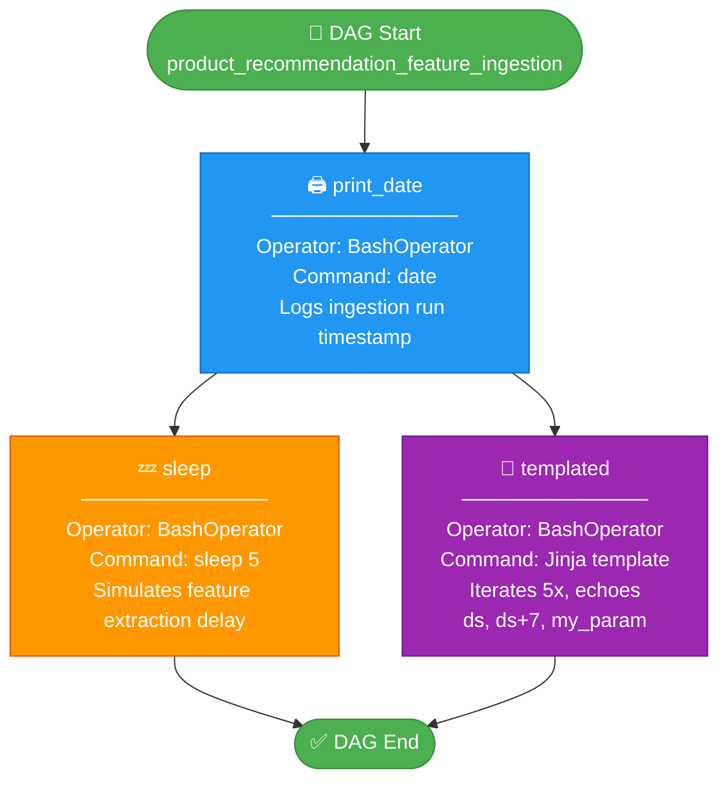
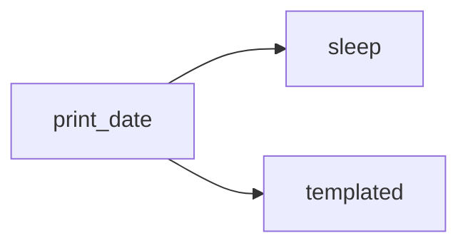
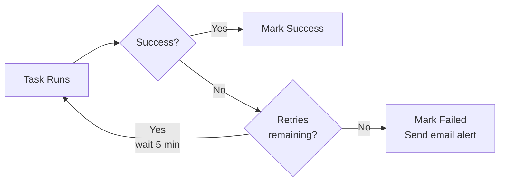

# Product Recs DAG
Feature Ingestion Pipeline for Product Recommendation

## Overview

| Attribute         | Value                                                      |
|-------------------|------------------------------------------------------------|
| **DAG ID**        | `product_recommendation_feature_ingestion`                 |
| **Owner**         | airflow                                                    |
| **Schedule**      | Daily (`@daily`)                                           |
| **Start Date**    | 2 days ago (relative)                                      |
| **Retries**       | 1 (retry delay: 5 minutes)                                 |
| **Operator Type** | `BashOperator`                                             |
| **Purpose**       | Ingest & transform product/user features for recommendation engine |

---

## DAG Flow

---

## Dependency Graph (simplified)

---

## Retry & Alerting Policy

